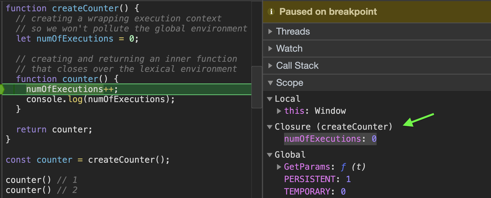

In this article we will learn about the concept of closures in JavaScript, we will see how functions can be stateful with persistent data across multiple executions. We will also explore some of the popular use cases of closure and different approaches for using them.

Lets start with a quote from [MDN](https://developer.mozilla.org/en-US/docs/Web/JavaScript/Closures):
>A closure is the combination of a function bundled together (enclosed) with references to its surrounding state (the lexical environment). In other words, a closure gives you access to an outer function’s scope from an inner function. In JavaScript, closures are created every time a function is created, at function creation time.

If you ask me, i would say that closures enables us to create stateful functions.

## Stateful functions

Stateful functions are functions that can "remember" data from previous executions. For example lets create a function that "remembers" and count how many times it got executed, each time that we will invoke it, it will log the number of times it got executed.

To do that, we will need some kind of a `counter` variable that will hold the current number of executions and will get incremented every time we invoke the function, the challenge here is to decide on where to put this variable.

Lets explore our first approach:

```jsx
function counter(){
  let numOfExecutions = 0;
  numOfExecutions++;
  console.log(numOfExecutions);
}

counter() // 1
counter() // 1
```

Obviously this won't work well, because we are re-creating the `numOfExecutions` variable every time we invoke `counter()`.

## Execution context

Every time we invoke a function, a new execution context is created, and each execution context has it's own "Variable Environment" or "scope" if you will. This local variable environment is holding all arguments that got passed to it and all declarations made inside the body of the function, in our case the `numOfExecutions` variable. When the function is "done", e.g with a `return` statement or there are no more lines of code to execute, the engine will mark it to be garbage collected, meaning it's entire environment will get disposed.

This is the reason our code above doesn't work well, every time we invoke `counter` we create a new execution context with a new declaration of the `numOfExecutions` variable and incrementing it to the value of `1`.

## Global execution context

When we start our program, the engine will create a global execution context for us, its not different from the execution context we create when we invoke a function. It also has a "Variable Environment" just like any other execution context, the difference is that the global execution context will never "die" (as long as our program is running of course), hence it's variable environment won't get disposed by the garbage collector.

So knowing that, we can maybe store our `numOfExecutions` in the global variable environment, this way we know it won't get re-created each time we invoke `counter`.

```jsx{1}
let numOfExecutions = 0;

function counter(){
  numOfExecutions++;
  console.log(numOfExecutions);
}

counter() // 1
counter() // 2
```

This works as we expect, we get the correct number of invocations, but you probably already know that storing variables on the global environment is considered as bad practice. For example see what happens if another function wants to use the exact same variable:

```jsx{9}
let numOfExecutions = 0;

function counter() {
  numOfExecutions++;
  console.log(numOfExecutions);
}

function someFunc() {
  numOfExecutions = 100;
}

someFunc()
counter() // 101
counter() // 102
```

As you can see we get some wrong numbers in here.

Another issue with this approach is that we can't run more than 1 instance of `counter`.

## Lexical Scope

Lexical Scope is basically a fancy way of saying "Static Scope", meaning we know at creation time what is the scope of our function.

Read this carefully:
> **WHERE** you define your function, determines what variables the function have access to **WHEN** it gets called.

In other words, id doesn't matter where and how you invoke the function, its all about where did it got declared.

But how do we declare a function in one place, and invoke it in another place? Well, we can create a function within a function and return it:

```jsx
function createFunc() {
  function newFunc(){
  
  }
  
  return newFunc;
}

const myFunc = createFunc();
myFunc()
```

It may seem useless, but lets explore the execution phase of our program:

1. We declare a new function with the `createFunc` label in the global variable environment.
2. We declare a new variable `myFunc` in the global variable environment which it's value will be the returned value from the execution of `createFunc`.
3. We invoke the `createFunc` function.
4. A new execution context is created (with a local variable environment).
5. We declare a function and giving it a label of `newFunc` (stored in the local variable environment of `createFunc`).
6. We return `newFunc`.
7. The returned **value** from `createFunc` is stored as the value of `myFunc` in the global variable environment.
8. The variable environment of `createFunc` is marked for disposal (meaning the `newFunc` variable will not exist).
9. We invoke `myFunc`.

Note that when we return the function `newFunc`, we return the actual function definition, not the label.

OK, so what can we do with this approach?

It turns out, that when we return a function, we are not only returning our function definition but we also return it's entire lexical environment. I.e, if we had some variable declared in the same context (or outer contexts), our returned function would *close over* them, and keep a reference to them.

Lets see that in action with our `counter` example:

```jsx
function createCounter() {
  // creating a wrapping execution context
  // so we won't pollute the global environment
  let numOfExecutions = 0;

  // creating and returning an inner function
  // that closes over the lexical environment
  function counter() {
    numOfExecutions++;
    console.log(numOfExecutions);
  }

  return counter;
}

const counter = createCounter();

counter() // 1
counter() // 2

```

As you can see, we are creating a wrapper execution context (`createCounter`) to store our `numOfExecutions` variable and we are returning the `counter` function. This way, every time we invoke `counter` it has access to the `numOfExecutions` variable. The fact that we are not re-running `createCounter` and only run `counter` let us persist `numOfExecutions` across executions of `counter`, thus allow `counter` to be stateful, meaning we can share data with multiple executions of this function.

If we debug `counter`'s execution we can see in the developer-tools that `numOfExecutions` is not stored in the local variable environment of `counter` but in it's "Closure" scope, (refers to as `[[Scope]]` in the spec).



But what if we wanted to return an object and not a function?

No problem, it will still work as expected:

```jsx
function createCounter() {
  let count = 0;

  function increment() {
    count++;
    return count;
  }

  function decrement() {
    count--;
    return count;
  }

  function reset() {
    count = 0;
  }

  function log() {
    console.log(count)
  }

  const counterObj = {
    increment,
    decrement,
    reset,
    log
  }

  return counterObj;
}

const counter = createCounter();

counter.increment()
counter.increment()
counter.increment()

counter.log() // 3

```

☝️ By the way, this pattern is usually called the "Module Pattern".

As you can see, it doesn't matter what we are returning, it doesn't matter where or when we are calling the functions, the only thing matters is where did we defined our functions:

> **WHERE** you define your function, determines what variables the function have access to **WHEN** it gets called.

Another bonus we get from returning a function or an object with functions is that we can create multiple instances of `counter`, each will be stateful and share data across executions but won't conflict between other instances:

```jsx
function createCounter() {
  let numOfExecutions = 0;

  function counter() {
    numOfExecutions++;
    console.log(numOfExecutions);
  }

  return counter;
}

const counter1 = createCounter();
const counter2 = createCounter();

counter1() // 1
counter1() // 2

counter2() // 1
counter2() // 2
```

As you can see, `counter1` and `counter2` are both stateful but are not conflicting with each others data, something we couldn't do with a global variable.

## Optimizations

Every returned function is closing over the **ENTIRE** lexical scope, meaning the entire lexical scope won't be garbage collected 🤔. This seems like a waste of memory and even a potential memory leak bug, should we re-consider the use of closures every time we need staeful functions?

Well, no. Most if not all browsers are optimizing this mechanism, meaning that in most cases only the variables that your function is actually using will be attached to the function's `[[scope]]`. Why in most cases and not all cases? Because in some cases the browser is unable to determine what variables the function is using, such as in case of using [eval](https://developer.mozilla.org/en-US/docs/Web/JavaScript/Reference/Global_Objects/eval). Obviously this is the smallest concern of using `eval`, [it is safer to use `Function` constructor](https://developer.mozilla.org/en-US/docs/Web/JavaScript/Reference/Global_Objects/eval#Never_use_eval!) instead.

## Wrapping up

We learned about how "Closure" works under the hood, with a link to the surrounding lexical context. We saw that scope wise, it doesn't matter when or where we are running our functions but where we are defining them, in other words: Lexical (static) binding. When we return a function, we actually returning not only the function but attach to it the entire lexical variable environment of all surrounding contexts (which browsers optimize and attach only referenced variables). This gives us the ability to create stateful functions with shared data across executions, it also allows us to create "private" variables that our global execution context doesn't have access to.

Hope you found this article helpful, if you have something to add or any suggestions or feedbacks I would love to hear about them, you can tweet or DM me [@sag1v](https://mobile.twitter.com/sag1v). 🤓
