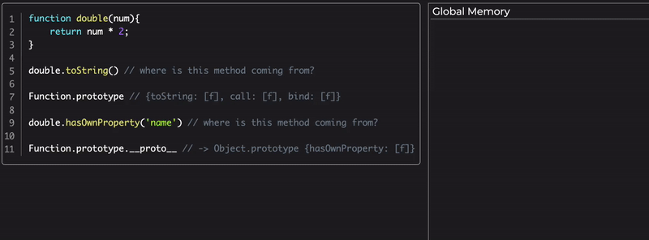

In this article we will learn about JavaScript's prototype chain. We will see how objects connect to other objects and how we can implement "inheritance" and relationships between these objects.

## Our Goal

As developers, our main task when we write code is usually to manipulate data. We get the data and store it some where, then we run functionality on that data.
Wouldn't it be nice to have the functionality and the relevant data bundled together on the same place? this would make it a lot easier for us.  

Imagine a `Player` object:

```jsx
{
  userName: 'sag1v',
  score: '700'
}
```

What if we want to run functionality on that object, like changing the score. Where would we put a `setScore` method?

## Objects

when we want to store related data we usually use objects, we use it like a box and we put inside it relevant peices.
Before we dive in, lets first understand what an `Object` is and explore some of the ways we can create objects.

### Object Literal

```jsx
const player1 = {
  userName: 'sag1v',
  score: '700',
  setScore(newScore){
    player1.score = newScore;
  }
}
```

Objects with literal notation (or "Object initializer") are an expression, each object initializer results in a new object being created whenever the statement in which it appears is executed.

We can also create or access the object's properties with a dot notation or bracket notations:

```jsx
const player1 = {
  name: 'Sagiv',
}

player1.userName = 'sag1v';
player1['score'] = 700;
player1.setScore = function(newScore) {
  player1.score = newScore;
}
```

### Object.create

Another option to create an `Object` is using the `Object.create` method:  

```jsx
const player1 = Object.create(null)
player1.userName = 'sag1v';
player1['score'] = 700;
player1.setScore = function(newScore) {
  player1.score = newScore;
}
```

`Object.create` will **always** return a new **empty** object, but we will get a bonus feature if we pass a different object to it. We will get back to it later on.

## Automating

Obviously we wouldn't want to create these object by hand every time, we might want to automate this operation. So lets create a function that will create a `Player` object for us.

### Factory Functions

```jsx
function createPlayer(userName, score) {
  const newPlayer = {
    userName,
    score,
    setScore(newScore) {
      newPlayer.score = newScore;
    }
  }
  return newPlayer;
}

const player1 = createPlayer('sag1v', 700);
```

This pattern is usually referred to as "Factory Functions", as in sort of a conveyor belt in a factory that outputs objects, we pass in the relevant arguments and get back the `Object` we need.

what happens if we run this function twice?

```jsx
function createPlayer(userName, score) {
  const newPlayer = {
    userName,
    score,
    setScore(newScore) {
      newPlayer.score = newScore;
    }
  }
  return newPlayer;
}

const player1 = createPlayer('sag1v', 700);
const player2 = createPlayer('sarah', 900);
```

we will get 2 objects with this shape:

```jsx
{
  userName: 'sag1v',
  score: 700,
  setScore: ƒ
}

{
  userName: 'sarah',
  score: 900,
  setScore: ƒ
}
```

Did you notice some duplications? Our `setScore` is stored for each instance, this is breaking the D.R.Y (Don't Repeat Yourself) principle.

What if we could store it somewhere else, once, and still be able to access it via the object instance: `player1.setScore(1000)`?

### OLOO - Objects Linked To Other Objects

Lets get back to `Object.create`, we said that it will **always** create an **empty** object but we will get a bonus feature if we pass an object to it.

```jsx
const playerFunctions = {
  setScore(newScore) {
    this.score = newScore;
  }
}

function createPlayer(userName, score) {
  const newPlayer = Object.create(playerFunctions);
  newPlayer.userName = userName;
  newPlayer.score = score;
  return newPlayer;
}

const player1 = createPlayer('sag1v', 700);
const player2 = createPlayer('sarah', 900);
```

This code works exactly like our previous code with one important difference, our new object instance doesn't hold the `setScore` method, it has a **link** to it in `playerFunctions`.

It turns out, that **ALL** objects in javascript have a special hidden property called `__proto__` (pronounced "dunder proto"), and if that property is pointing to an object then the engine will treat this object's properties as if they were on the instance itself. In other words, every object can link to another object via the `__proto__` property and access it's properties like they were it's own.

#### ️️⚠️ Note

Don't confuse `__proto__` with the `prototype` property, `prototype` is a property that only exists on functions. `__proto__` on the other hand is a property that **only**  exists on objects. To make it more confusing, The `__proto__` property is called `[[Prototype]]` in the [EcmaScript specifications](https://www.ecma-international.org/ecma-262/6.0/#sec-ordinary-object-internal-methods-and-internal-slots).

We will comeback to that later on 🤔

Lets see an example with our code for a better visualization:

```jsx
const playerFunctions = {
  setScore(newScore) {
    this.score = newScore;
  }
}

function createPlayer(userName, score) {
  const newPlayer = Object.create(playerFunctions);
  newPlayer.userName = userName;
  newPlayer.score = score;
  return newPlayer;
}

const player1 = createPlayer('sag1v', 700);
const player2 = createPlayer('sarah', 900);

console.log(player1)
console.log(player2)
```

This will output:

```jsx
player1: {
  userName: 'sag1v',
  score: 700,
  __proto__: playerFunctions
}

player2: {
  userName: 'sarah',
  score: 900,
  __proto__: playerFunctions
}
```

Which means, both `player1` and `player2` have access to the properties of `playerFunctions`, meaning they both can run `setScore`:

```jsx
player1.setScore(1000);
player2.setScore(2000);
```

We achieved our goal here, we have objects with data and functionality attached to them and we didn't break the D.R.Y principle.

But this seems like a lot of effort to put just for creating linked objects:  

1. We need to create the object.
2. We need to create a different object that holds our functionality.
3. We must use `Object.create` to link the `__proto__` property to the functionality object.
4. We need to populate the new object with properties.
5. We need to return the new object.

What if some of these tasks could be done for us?

### The `new` operator - A.K.A Constructor function

In the previous example we saw that we have some "tasks" to do in order to create our linked object inside the factory function. JavaScript can do some of these tasks for us if we just use the `new` operator with a function invocation.

But before we see that in action, let's make sure we are on the same page regarding what a function is.

#### What is a function really?

```jsx
function double(num) {
    return num * 2;
}

double.someProp = 'Hi there!';

double(5); // 10
double.someProp // Hi there!

double.prototype // {}
```

We all know what a function is right? We can declare it, then invoke it with parentheses `()`. But looking at the code above, we can also read or create properties on it, exactly like we can do with objects. So my conclusion here is that functions in JavaScript are not *just* functions, they are sort of a "function & object combination". Basically **every** function can be invoked **AND** can be treated like an object.

##### The prototype property

It turns out, that all functions (with the exception of [arrow functions](https://developer.mozilla.org/en-US/docs/Web/JavaScript/Reference/Functions/Arrow_functions#Use_of_prototype_property)) have a `.prototype` property on them.

Yeah, here is the warning again:
>Not `__proto__` or `[[Prototype]]`, but `prototype`.

Now lets get back to the **new operator**.

##### Invoking with the `new` operator

This is how our function might look like with the `new` operator:

⚠️ If you are not 100% sure you understand how the `this` key word works, you might want to read [JavaScript - The "this" key word in depth](https://www.debuggr.io/js-this-in-depth/)

```jsx
function Player(userName, score){
  this.userName = userName;
  this.score = score;
}

Player.prototype.setScore = function(newScore){
  this.score = newScore;
}

const player1 = new Player('sag1v', 700);
const player2 = new Player('sarah', 900);

console.log(player1)
console.log(player2)
```

And this is the output:

```jsx
Player {
  userName: "sag1v",
  score: 700,
  __proto__: Player.prototype
}

Player {
  userName: "sarah",
  score: 900,
  __proto__: Player.prototype
}
```

##### Lets walk through that code (execution phase)

We are executing the `Player` function with the `new` operator, note that i changed the name of the function from `createPlayer` to `Player`, only because this is a convention among developers. This is a way to signal to the consumer of the `Player` function that this is a "Constructor Function" and should be invoked with the `new` operator.

When we invoke a function with the `new` operator, JavaScript will do 4 things for us:

1. It will create a new Object.
2. It will assign the new Object to the `this` context.
3. It will linked the `__proto__` property of that new object to the `prototype` property of the function. `Player.prototype` in our case.
4. It will return this new object, unless you return a different object.

If we would write the automated steps done by JavaScript it might look like the following snippet:

```jsx{2-3,8}
function Player(userName, score){
  this = {} // ⚠️ done by JavaScript
  this.__proto__ = Player.prototype // ⚠️ done by JavaScript

  this.userName = userName;
  this.score = score;

  return this // ⚠️ done by JavaScript
}
```

Lets look at step #3:
>It will linked the `__proto__` property of that new object to the `prototype` property of the function...

Meaning we can put any methods on `Player.prototype` and they will be available to our newly created object.

And this is exactly what we did:

```jsx
Player.prototype.setScore = function(newScore){
  this.score = newScore;
}
```

So this is how we can create objects linked to other objects with the Constructor functions.

By the way, if we didn't use the `new` operator, JavaScript wouldn't do these tasks for us, we would just end up mutating or creating some properties on the `this` context. Remember this option, we will use this trick when we will do sub-classing.

There are ways to make sure the function was called with the `new` operator:

```jsx
function Player(username, score){

  if(!(this instanceof Player)){
    throw new Error('Player must be called with new')
  }

  // ES2015 syntax
  if(!new.target){
    throw new Error('Player must be called with new')
  }
}
```

Again, for an in depth explanation about the `this` key word you can read [JavaScript - The "this" key word in depth](http://localhost:8000/js-this-in-depth/).

## Class

If you don't like to write factory functions by hand or you don't like the constructor function syntax or manually checking if the function was called with the new operator, JavaScript also provides a `class` (since ES2015). Keep in mind though, that classes are **mostly** a syntactic sugar over functions and they are very different from the traditional classes in other languages, we are still using a "prototypal inheritance".

A quote from [MDN](https://developer.mozilla.org/en-US/docs/Web/JavaScript/Reference/Classes):

> JavaScript classes, introduced in ECMAScript 2015, are primarily syntactical sugar over JavaScript's existing prototype-based inheritance. The class syntax does not introduce a new object-oriented inheritance model to JavaScript.

Lets convert our "constructor function" to a `class` step by step:

### Declare a class

We use the `class` key word and name our class the same way we named our constructor function from the previous section.

```jsx
class Player {

}
```

### Create a constructor

We will take the constructor function's body from the previous section and create a `constructor` method for our class with it:

```jsx{2-5}
class Player {
  constructor(userName, score) {
    this.userName = userName;
    this.score = score;
  }
}
```

### Add methods to the class

Every method we want to attach to the `Player.prototype` can be simply declared as a class method:

```jsx{7-9}
class Player {
  constructor(userName, score) {
    this.userName = userName;
    this.score = score;
  }

  setScore(newScore) {
    this.score = newScore;
  }
}
```

Now the entire code

```jsx{12-13,15-16}
class Player {
  constructor(userName, score) {
    this.userName = userName;
    this.score = score;
  }

  setScore(newScore) {
    this.score = newScore;
  }
}

const player1 = new Player('sag1v', 700);
const player2 = new Player('sarah', 900);

console.log(player1)
console.log(player2)
```

When we run the code, we get the same output as before:

```jsx
Player {
  userName: "sag1v",
  score: 700,
  __proto__: Player.prototype
}

Player {
  userName: "sarah",
  score: 900,
  __proto__: Player.prototype
}
```

As you can see, `class` works and behave the same as a function with a prototype chain, its just a different syntax. You also get a built-in check that the `class` function was invoked with the `new` operator.

## Sub-Classing - A.K.A Inheritance

What if we wanted a special kind of `Player`, maybe a paid user `Player` who has unlocked features that a regular `Player` doesn't have, such as the ability to change the user-name.

So lets see what our goal here:

- We want that a regular player will have a `userName`, a `score` and a `setScore` method.  
- We also want a paid user player that will have all the things a regular player has + a `setUserName` method, but obviously we don't want the regular player to have this ability.

Before we dive into it, lets visualize a chain of linked objects:

Consider the code below:

```jsx
function double(num){
    return num * 2;
}

double.toString() // where is this method coming from?

Function.prototype // {toString: f, call: f, bind: f}

double.hasOwnProperty('name') // where is this method coming from?

Function.prototype.__proto__ // -> Object.prototype {hasOwnProperty: f}
```

We know that if a property is not directly on the object, the engine will look for this property on the linked object (if exists) via the `__proto__` property. But what happens if the property we are looking for is not there as well? Well as we previously learned, **all** objects have a `__proto__` property, so the engine will check the next linked object via the `__proto__` property, and if the property we are looking for is not there? well i think you get it, the engine will keep going up the chain via the `__proto__` property until it hits a dead end, i.e a null reference, which is basically the `Object.prototype.__proto__`.

So if we step through the code example:

```jsx
double.toString()
```

1. `double` has no `toString` method ✖️.
2. Go through `double.__proto__`
3. `double.__proto__` is pointing to `Function.prototype` which is an object that contains the `toString` method. Check ✔️

```jsx
double.hasOwnProperty('name')
```

1. `double` has no `hasOwnProperty` method ✖️.
2. Go through `double.__proto__`
3. `double.__proto__` is pointing to `Function.prototype`.
4. `Function.prototype` has no `hasOwnProperty` method ✖️.
5. Go through `Function.prototype.__proto__`.
6. `Function.prototype.__proto__` is pointing to `Object.prototype`.
7. `Object.prototype` is an object that contains the `hasOwnProperty` method. Check ✔️

Here is a small animated gif to demonstrate the process:



Now back to our task of creating a paid user entity. We will go all the way again, we will implement this feature with the "OLOO pattern", "Constructor Functions" pattern and with classes. This way we will see the tradeoffs for each pattern and feature.

So lets dive in to sub-classing. 💪

## OLOO - Sub Classing

This is the implementation of our task with the OLOO and factory function pattern:

```jsx
const playerFunctions = {
  setScore(newScore) {
    this.score = newScore;
  }
}

function createPlayer(userName, score) {
  const newPlayer = Object.create(playerFunctions);
  newPlayer.userName = userName;
  newPlayer.score = score;
  return newPlayer;
}

const paidPlayerFunctions = {
  setUserName(newName) {
    this.userName = newName;
  }
}

// link paidPlayerFunctions object to createPlayer object
Object.setPrototypeOf(paidPlayerFunctions, playerFunctions);

function createPaidPlayer(userName, score, balance) {
  const paidPlayer = createPlayer(name, score);
  // we need to change the pointer here
  Object.setPrototypeOf(paidPlayer, paidPlayerFunctions);
  paidPlayer.balance = balance;
  return paidPlayer
}

const player1 = createPlayer('sag1v', 700);
const paidPlayer = createPaidPlayer('sag1v', 700, 5);

console.log(player1)
console.log(paidPlayer)
```

This will output:

```jsx
player1 {
  userName: "sag1v",
  score: 700,
  __proto__: playerFunctions {
     setScore: ƒ
  }
}

paidPlayer {
  userName: "sarah",
  score: 900,
  balance: 5,
  __proto__: paidPlayerFunctions {
    setUserName: ƒ,
    __proto__: playerFunctions {
      setScore: ƒ
    }
  }
}
```

As you can see, our `createPlayer` function implementation didn't change, but with the `createPaidPlayer` function we needed to pull some tricks. 

In `createPaidPlayer` we are using the `createPlayer` to create the initial new object so we won't need to duplicate the logic of creating a new player, but unfortunately its linking our `__proto__` to the wrong object, se we need to fix that with the `Object.setPrototypeOf` method. We pass it the target object (the newly created object that we need to fix it's `__proto__` pointer) and we pass it the correct object we want it to point to, e.g `paidPlayerFunctions`. 

We are not done yet though, because now we broke the linkage to the `playerFunctions` object which holds the `setScore` method. This is why we needed to link between `paidPlayerFunctions` and `playerFunctions`, again with `Object.setPrototypeOf`. This way we make sure our `paidPlayer` is linked to `paidPlayerFunctions` and then from there to `playerFunctions`.

This is a lot of code for a 2 level chaining, imagine the hassle for 3 or 4 levels of chaining.

## Constructor Functions - Sub Classing

Now lets implement the same thing with constructor functions.

```jsx
function Player(userName, score) {
  this.userName = userName;
  this.score = score;
}

Player.prototype.setScore = function(newScore) {
  this.score = newScore;
}

const paidPlayerFunctions = {
  setUserName(newName) {
    this.userName = newName;
  }
}


function PaidPlayer(userName, score, balance) {
  this.balance = balance;
  /* we are calling "Player" without the "new" operator
  but we use the "call" method,
  which allows us to explicitly pass a ref for "this".
  Now the "Player" function will mutate "this"
  and will populate it with the relevant properties */
  Player.call(this, userName, score);
}

PaidPlayer.prototype.setUserName = function(newName) {
  this.userName = newName;
}

// link PaidPlayer.prototype object to Player.prototype object
Object.setPrototypeOf(PaidPlayer.prototype, Player.prototype);


const player1 = new Player('sag1v', 700);
const paidPlayer = new PaidPlayer('sarah', 900, 5);

console.log(player1)
console.log(paidPlayer)
```

And we should get similar output to the previous implementation:

```jsx
Player {
  userName: "sag1v",
  score: 700,
  __proto__: Player.prototype {
    setScore: ƒ
  }
}

PaidPlayer {
  userName: "sarah",
  score: 900,
  balance: 5,
  __proto__: PaidPlayer.prototype:{
    setUserName: ƒ,
    __proto__: Player.prototype {
      setScore: ƒ
    }
  }
}
```

This is effectively the same results that we got with the factory function patten but with some stuff that were automated for us by the `new` operator. It might saved us some lines of code but it did introduce some other challenges.

Our first challenge was how do we use the `Player` function to get the logic of creating the initial `Player`. We did this by calling it without the `new` operator (against all our instincts!) and using the `.call` method which allowed us to explicitly pass a reference for `this`, this way the `Player` function is not operating as a constructor method so it won't create a new object and assign it to `this`

```jsx{8}
function PaidPlayer(userName, score, balance) {
  this.balance = balance;
  /* we are calling "Player" without the "new" operator
  but we use the "call" method,
  which allows us to explicitly pass a ref for "this".
  Now the "Player" function will mutate "this"
  and will populate it with the relevant properties */
  Player.call(this, userName, score);
}
```

We are only using `Player` here to mutate our passed in `this` which is basically the newly created object inside the context of `PaidPlayer`.

Another challenge we have, is to link the instance returned by `PaidPlayer` to the functionality that instances of `Player` have, we did that with `Object.setPrototypeOf` and we linked `PaidPlayer.prototype` to `Player.prototype`.

```jsx
// link PaidPlayer.prototype object to Player.prototype object
Object.setPrototypeOf(PaidPlayer.prototype, Player.prototype);
```

As you can see, the more things our engine is doing for us the less code we need to write, but as the amount of abstraction grow its harder for us to keep track about what is happening under the hood.

## Class - Sub Classing

With classes we get much, much more abstraction, this means less code:

```jsx
class Player {
  constructor(userName, score) {
    this.userName = userName;
    this.score = score;
  }

  setScore(newScore) {
    this.score = newScore;
  }
}

class PaidPlayer extends Player {
  constructor(userName, score, balance) {
    super(userName, score);
    this.balance = balance;
  }

  setUserName(newName) {
    this.userName = newName;
  }
}


const player1 = new Player('sag1v', 700);
const paidPlayer = new PaidPlayer('sarah', 900, 5);

console.log(player1)
console.log(paidPlayer)
```

And we get the same output as we got with the constructor functions:

```jsx
Player {
  userName: "sag1v",
  score: 700,
  __proto__: Player.prototype {
    setScore: ƒ
  }
}

PaidPlayer {
  userName: "sarah",
  score: 900,
  balance: 5,
  __proto__: PaidPlayer.prototype:{
    setUserName: ƒ,
    __proto__: Player.prototype {
      setScore: ƒ
    }
  }
}
```

So as you see, classes are nothing but a syntactic sugar over the constructor functions. Well sort of 🤔

Remember this line from the docs:
>JavaScript classes, introduced in ECMAScript 2015, are primarily syntactical sugar over JavaScript’s existing prototype-based inheritance...

Yeah, **primarily**.

When we used the `extends` key word, we needed to use the `super` function, why?

Remember this (strange) line from the "Constructor Functions" section:

```jsx
Player.call(this, userName, score)
```

so `super(userName, score)` is kind of a way to mimic it.

Well if we want to be a bit more accurate here, under the hood it uses a new feature that introduced with ES2015: [Reflect.construct](https://developer.mozilla.org/en-US/docs/Web/JavaScript/Reference/Global_Objects/Reflect/construct).

Quoting from the docs:

>The static Reflect.construct() method acts like the new operator, but as a function. It is equivalent to calling new target(...args). It gives also the added option to specify a different prototype.

So we don't need to "hack" the constructor functions anymore. Basically under the hood the `super` is implemented with `Reflect.construct`. Its also important to mention that when we `extend` a class, inside the `constructor` body we can't use `this` before we run `super()`, because `this` is uninitialized yet.

```jsx
class PaidPlayer extends Player {
  constructor(userName, score, balance) {
    // "this" is uninitialized yet...
    // super refers to Player in this case
    super(userName, score);
    // under the hood super is implemented with Reflect.construct
    // this = Reflect.construct(Player, [userName, score], PaidPlayer);
    this.balance = balance;
  }

  setUserName(newName) {
    this.userName = newName;
  }
}
```

## Wrapping up

We learned about the the different ways we can connect objects, attaching data and logic and bundling it all together. We saw how "inheritance" works in JavaScript, chaining objects to other objects via the `__proto__` property, sometimes with multiple levels of chaining.

We see it again and again, the more abstraction we get the more "stuff" are going on under the hood, which makes it harder for us to keep track on whats going on with our code.

Each pattern has it's pros and cons:

- With `Object.create` we need to write more code but we have a more fine-grained control over our objects. Though it becomes tedious to do deep level chaining.
- With the constructor functions we get some automated tasks done by JavaScript but the syntax may look a bit strange. We also need to make sure that our functions get invoked with the `new` key word or we will face nasty bugs. Deep level chaining isn't that great as well.
- With classes we get a cleaner syntax and a built-in check that it was invoked with the `new` operator. Classes shines the most when we do "inheritance", we just use the `extends` key word and invoking `super()` instead of jumping hoops with the other patterns. The syntax is also more closer to other languages and it looks like an easy thing to learn. Though this is also a downside because as we saw, its so different than classes in other languages, we still use the old "Prototypal Inheritance" with a lot of layers of abstractions over it.

Hope you found this article helpful, if you have something to add or any suggestions or feedbacks I would love to hear about them, you can tweet or DM me [@sag1v](https://mobile.twitter.com/sag1v). 🤓
