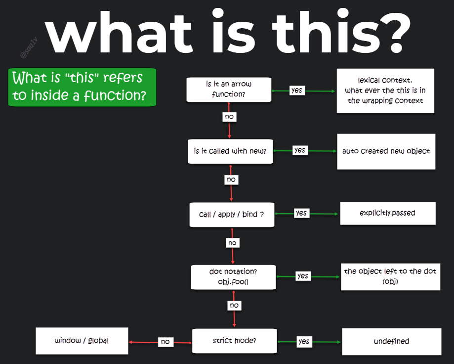

In this article we will learn how to identify and recognize what `this` refers to in a given context and we will explore what rules and conditions are taken under consideration by the engine to determine the reference of the `this` key word. 

## The challenge
One of the most challenging concepts in JavaScript is the `this` key word, maybe because it is so different than other languages or maybe because the rules to determine it's value are not that clear.

Lets quote a paragraph from [MDN](https://developer.mozilla.org/en-US/docs/Web/JavaScript/Reference/Operators/this):
> In most cases, the value of this is determined by how a function is called (runtime binding). It can't be set by assignment during execution, and it may be different each time the function is called... 

Challenging indeed, on one hand it says that `this` is determined at run-time - i.e, a dynamic binding, but on the other hand it says `In most cases...`, meaning it can be statically bound. How doe's something can be both static and dynamic and how can we be sure which one it is at a given context? This is exactly what we are going to find out now!

## What is static?
Let's look at an example of something static in JavaScript, like the "Local variable environment" - often refers to as scope.

Every time a function is invoked, a new execution context is created and pushed to the top of the [call-stack](https://developer.mozilla.org/en-US/docs/Glossary/Call_stack) (when our application starts, there is already a default execution context which is often referred to as the global-context).
Each execution context contains a "Local variable environment" which usually referred to as the local-scope (or global-scope in the global execution context).
 
Given this code snippet:
```js
function foo(){
  var message = 'Hello!';
  console.log(message);
}
foo()
```  

Just by looking at `foo`'s declaration, we know what scope `message` belongs to - the local scope of the `foo` function execution-context. Because `var` statement [declares a function-scoped variable](https://developer.mozilla.org/en-US/docs/Web/JavaScript/Reference/Statements/var).

Another example:
```js
function foo(){
  var message = 'Hello';
  {
    let message = 'there!'
    console.log(message) // there!
  }
  console.log(message) // Hello
}

foo()
```
Notice how inside the block we get a different result than outside of it, that's because `let` statement [declares a block scope local variable](https://developer.mozilla.org/en-US/docs/Web/JavaScript/Reference/Statements/let).

We know what to expect just by looking at the deceleration of the function because scope in JavaScript is statically determined (lexical), or at "Design time" if you will. 
No matter where and how we will run the function, it's local scope won't change.
In other words, we can say that the scope of a variable is depended on **where** the variable was **declared**. 

## What is dynamic?
If static means "**Where** something **WAS** declared", we might say dynamic means "**How** something **WILL** run".

Lets imagine for a moment that scope was dynamic in JavaScript:
_note, this is not a real syntax_ ⚠️
```js
function foo(){
  // not a real syntax!!! ⚠️
  let message = if(foo in myObj) "Hello" else "There"
  console.log(message)
}

let myObj = {
  foo
}; 

myObj.foo() // Hello
foo() // There
``` 

As you can see, in contrast to the static scope example we now can't determine the final value of `message` just by looking at the declaration of `foo`, we will need to see where and how its being invoked. That's because the value of the `message` variable is determined upon the execution of `foo` with a set of conditions. 
It may look strange but this is not that far away from the truth when we are dealing with the `this` context, every time we run a function the JavaScript engine is doing some checks and conditionally set the reference of `this`.

There are some rules, and **order matters**. 
You know what, lets just write them out as if we are writing the engine ourselves:
_note, this is not a real syntax_ ⚠️
```javascript
function foo(){
  // not real syntax!!! ⚠️
  if(foo is ArrowFunction) doNothing;
  else if(foo called with new) this = {};
  else if(
    foo called with apply || 
    foo called with call  ||
    foo called with bind  ||
  ) this = thisArg
  else if(foo called within an object) this = thatObject
  else if(strictMode){
    this = undefined
  } else{
    // default binding, last resort
    this = window;
    // or global in node
  }

  console.log(this); 
  // who knows? we need to see where and how it runs
}
```
Seems a bit cumbersome and complex, maybe this flow chart will provide a better visualization:



As you can see we can split the flow into two parts:
* Static binding - The arrow function
* Dynamic binding - The rest of the conditions

Lets walk them through:
1. **Is it an [arrow function](https://developer.mozilla.org/en-US/docs/Web/JavaScript/Reference/Functions/Arrow_functions#No_separate_this)?** - 
If the relevant execution context is created by an arrow function then do nothing, meaning `this` will be whatever it was set by the wrapping execution context.
2. **Was the function called with [`new`](https://developer.mozilla.org/en-US/docs/Web/JavaScript/Reference/Operators/new)?** - 
When invoking a function with the `new` key word the engine will do some things for us:
    * Create a new object and set `this` to reference it.
    * Reference that object's `__proto__` (called `[[Prototype]]` in the [spec](https://www.ecma-international.org/ecma-262/10.0/index.html#sec-ordinary-object-internal-methods-and-internal-slots)) to 
    the [function's prototype object](https://developer.mozilla.org/en-US/docs/Web/JavaScript/Reference/Global_Objects/Function/prototype).
    * Return the newly created object (`this`).

    So for our purpose to determine what `this` is, we know it will be a new object that was created automatically just by invoking the function with the `new` key word.
3. **Was the function called with [`call`](https://developer.mozilla.org/en-US/docs/Web/JavaScript/Reference/Global_Objects/Function/call) / [`apply`](https://developer.mozilla.org/en-US/docs/Web/JavaScript/Reference/Global_Objects/Function/apply) or [`bind`](https://developer.mozilla.org/en-US/docs/Web/JavaScript/Reference/Global_objects/Function/bind)?** -
Then set `this` to whatever passed as the first argument.
4. **Was the function called as an [object method](https://developer.mozilla.org/en-US/docs/Web/JavaScript/Reference/Functions/Method_definitions)** -
Then set `this` to the object left to the dot or square brackets.
5. **Is [`strict mode`](https://developer.mozilla.org/en-US/docs/Web/JavaScript/Reference/Strict_mode) on?** -
Then `this` is `undefined`
6. **default case** - 
`this` will reference the global / window.

 
## The Quiz
The best way to measure our understanding is to test ourselves, so lets do a quiz. open the flowchart on a new tab and walk through it from top to bottom for each question (answers are listed below):

_Try to answer what will be printed to the console._

Question #1
```js
function logThis(){
  console.log(this);
}

const myObj = {
  logThis
}

myObj.logThis()
```

Question #2
```js
function logThis(){
  console.log(this);
}

const myObj = {
  foo: function(){
    logThis();
  }
}

myObj.foo()
```

Question #3
```js
const logThis = () => {
  console.log(this);
}

const myObj = {
  foo: logThis
}

myObj.foo()
```

Question #4
```js
function logThis() {
  console.log(this);
}

const myObj = { name: "sag1v" }

logThis.apply(myObj)
```

Question #5
```js
const logThis = () => {
  console.log(this);
}

const myObj = { name: "sag1v" }

logThis.apply(myObj)
```

Question #6
```js
function logThis(){
  console.log(this);
}

const someObj = new logThis()
```

Question #7
```js
function logThis(){
  'use strict'
  console.log(this);
}

function myFunc(){
  logThis();
}

const someObj = new myFunc()
```

Question #8
```js
function logThis(){
  console.log(this);
}

class myClass {
  logThat(){
    logThis()
  }
}

const myClassInstance = new myClass()
myClassInstance.logThat()
```

Question #9
```js
function logThis(){
  console.log(this);
}

class myClass {
  logThat(){
    logThis.call(this)
  }
}

const myClassInstance = new myClass()
myClassInstance.logThat()
```

Question #10
```js
class myClass {
  logThis = () => {
    console.log(this);
  }
}

const myObj = { name: 'sagiv' };

const myClassInstance = new myClass()
myClassInstance.logThis.call(myObj)
```
### Bonus questions

Question #11
```js
function logThis() {
  console.log(this);
}

const btn = document.getElementById('btn');
btn.addEventListener('click', logThis);
```

Question #12
```js
const logThis = () => {
  console.log(this);
}

const btn = document.getElementById('btn');
btn.addEventListener('click', logThis);
```

---
Answers
---

Answer #1
```js
function logThis(){
  console.log(this);
}

const myObj = {
  logThis
}

myObj.logThis()
```

Result - `myObj`.
Explanation:
* Is `logThis` an arrow function? - No.
* Was `logThis` called with `new`? - No.
* Was `logThis` called with call / apply / bind? - No.
* Was `logThis` called as an object method? - Yes, `myObj` is left to the dot.

Answer #2
```js
function logThis(){
  console.log(this);
}

const myObj = {
  foo: function(){
    logThis();
  }
}

myObj.foo()
```
Result - `window`.
Explanation:
* Is `logThis` an arrow function? - No.
* Was `logThis` called with `new`? - No.
* Was `logThis` called with call / apply / bind? - No.
* Was `logThis` called as an object method? - No.
* Is `strict mode` on? - No.
* default case - `window` (or global).

Answer #3
```js
const logThis = () => {
  console.log(this);
}

const myObj = {
  foo: logThis
}

myObj.foo()
```
Result - `window`.
Explanation:
* Is `logThis` an arrow function? - Yes, whatever `this` set in the wrapping context. In this case the wrapping context is the ["Global execution context"](https://developer.mozilla.org/en-US/docs/Web/JavaScript/Reference/Operators/this#Global_context) which inside it `this` refers to the window / global object.

Answer #4
```js
function logThis() {
  console.log(this);
}

const myObj = { name: "sag1v" }

logThis.apply(myObj)
```
Result - `myObj`.
Explanation:
* Is `logThis` an arrow function? - No.
* Was `logThis` called with `new`? - No.
* Was `logThis` called with call / apply / bind? - Yeas, whatever passed in as the first argument - `myObj` in this case.

Answer #5
```js
const logThis = () => {
  console.log(this);
}

const myObj = { name: "sag1v" }

logThis.apply(myObj)
```
Result - `window`.
Explanation:
* Is `logThis` an arrow function? - Yes, whatever `this` set in the wrapping context. In this case the wrapping context is the "Global execution context" which inside it `this` refers to the window / global object.

Answer #6
```js
function logThis(){
  console.log(this);
}

const someObj = new logThis()
```
Result - The object created by `logThis`.
Explanation:
* Is `logThis` an arrow function? - No.
* Was `logThis` called with `new`? - Yes, then `this` is an auto created object inside the function.

Answer #7
```js
function logThis(){
  'use strict'
  console.log(this);
}

function myFunc(){
  logThis();
}

const someObj = new myFunc()
```
Result - `undefined`.
Explanation:
* Is `logThis` an arrow function? - No.
* Was `logThis` called with `new`? - No.
* Was `logThis` called with call / apply / bind? - No.
* Was `logThis` called as an object method? - No.
* Is `strict mode` on? - Yes, `this` is `undefined`.

Answer #8
```js
function logThis(){
  console.log(this);
}

class myClass {
  logThat(){
    logThis()
  }
}

const myClassInstance = new myClass()
myClassInstance.logThat()
```
Result - `window`.
Explanation:
* Is `logThis` an arrow function? - No.
* Was `logThis` called with `new`? - No.
* Was `logThis` called with call / apply / bind? - No.
* Was `logThis` called as an object method? - No.
* Is `strict mode` on? - No.
* default case - `window` (or global).

Answer #9
```js
function logThis(){
  console.log(this);
}

class myClass {
  logThat(){
    logThis.call(this)
  }
}

const myClassInstance = new myClass()
myClassInstance.logThat()
```
Result - The object created by `myClass`.
Explanation:
* Is `logThis` an arrow function? - No.
* Was `logThis` called with `new`? - No.
* Was `logThis` called with call / apply / bind? - Yes, whatever passed in as first argument. OK, but we are passing `this`! what is `this` refers to inside the `logThat` execution context?
Lets check:
  * Is `logThat` an arrow function? - No.
  * Was `logThat` called with `new`? - No.
  * Was `logThat` called with call / apply / bind? - No.
  * Was `logThat` called as an object method? - Yes, `this` is the object left to the dot - The auto created object inside `myClass` in this case.

Answer #10
```js
class myClass {
  logThis = () => {
    console.log(this);
  }
}

const myObj = { name: 'sagiv' };

const myClassInstance = new myClass()
myClassInstance.logThis.call(myObj)
```
Result - The object created by `myClass`.
Explanation:
* Is `logThis` an arrow function? - Yes, `this` refers to whatever the wrapping context set it, `myClass` in this case.
Lets check what `this` refers to in the wrapping context:
    * Is `myClass` an arrow function? - No.
    * Was `myClass` called with `new`? - Yes, `this` refers to the newly created object (the instance).

_note that we are using class fields which is a [proposal currently in stage 3](https://github.com/tc39/proposal-class-fields#class-field-declarations-for-javascript)_

Answer #11
```js
function logThis() {
  console.log(this);
}

const btn = document.getElementById('btn');
btn.addEventListener('click', logThis);
```
Result - The `btn` element.
Explanation
This is a tricky question because we never talked about event handlers attached to `DOM` elements. You can look at event handlers that are attached to `DOM` elements as if the function is a method inside the element's object, In our case the `btn` object. We can look at it as if we did `btn.click()` or even `btn.logThis()`. Note that this is not exactly whats going on under the hood, but this visualization of the invocation of the handler can help us with the formation of our "mental model" regarding the setting of `this`. 
You can read more about it on the [MDN](https://developer.mozilla.org/en-US/docs/Web/JavaScript/Reference/Operators/this#As_a_DOM_event_handler)

Now lets walk through the flow:
* Is `logThis` an arrow function? - No.
* Was `logThis` called with `new`? - No.
* Was `logThis` called with call / apply / bind? - No.
* Was `logThis` called as an object method? - Yes (sort of), in our case `btn` is left to the dot.

Answer #12
```js
const logThis = () => {
  console.log(this);
}

const btn = document.getElementById('btn');
btn.addEventListener('click', logThis);
```
Result - `window`.
Explanation
* Is `logThis` an arrow function? - Yes, whatever `this` set in the wrapping context. In this case the wrapping context is the "Global execution context" which inside it `this` refers to the window / global object.


## Wrapping up
We now understand that the assignment of `this` can be both dynamic and static (lexical).  
- Arrow functions will make it static and won't even bother to mutate `this` at all. which means we will need to understand what `this` was set to in the wrapping execution context.
- Plain Functions will make it dynamically, meaning it depends on how the function was invoked.

It may look intimidating and complex now, you probably thinking how would you remember the flow chart. Well you don't need to, you can save or print this flow-chart or maybe even make your own. Every time you need to know what `this` refers to in your code just look at it and start going through the conditions. Rest assure, you will need to look at this flow-chart less and less as time goes by.

I hope it was informative and helpful, if you have any further clarifications or corrections, feel free to comment or DM me on twitter ([@sag1v](https://twitter.com/sag1v)). 