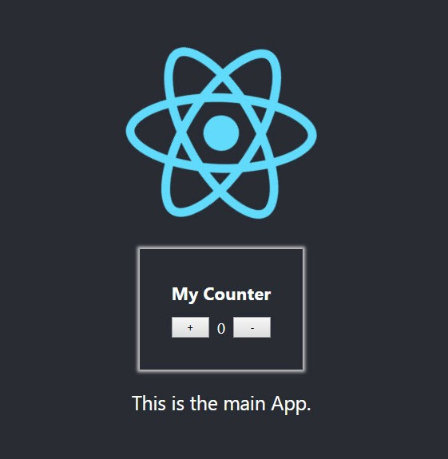

In this article / tutorial we will build a very basic react “widget” (a Counter!) and a very basic react application.we will see what problems we face when we try to interact with the two applications and how [ReactDOM.render](https://reactjs.org/docs/react-dom.html#render) API help us to pass data in and out the applications while keeping the great unidirectional flow.

*Note: you can implement this with any view framework / library, 
I just chose to do it with 2 react applications because i mostly work with react, but you can pass and get data from a react app with angular / vue / jQuery or vanilla JS.it doesn’t matter.*

This is a followup article for this tweet

https://twitter.com/sag1v/status/1059579044826615808

This may address only specific use cases, like already existing applications or mini applications that you can’t or won’t rewrite, or stand-alone application which you need to provide to others to implement on their websites and you want to provide an API to interact with your application.

## Lets Code

To make it easy to start and not waste time on building the “widget” and main application, [i published a repository](https://github.com/sag1v/react-external-integration-starter) that will save you the time and hassle.

This repo holds 2 folders:

1. main-app (the main application project) 
2. counter-app (our counter widget project)

*Both of them built using [create-react-app](https://github.com/facebook/create-react-app) (because it’s easy, it’s fast and it just works)*

*Note that you don’t have to do it with create-react-app, you may already have a js build system running on your existing application.
You may want to read [Add React to a Website](https://reactjs.org/docs/add-react-to-a-website.html) from the DOCS*

## **Clone**

clone the repository to your local drive

``` bash
git clone https://github.com/sag1v/react-external-integration-starter.git
```

## Install And Run

main-app

``` bash
cd main-app
npm install
npm start
```

counter-app

``` bash
cd counter-app
npm install
npm start
```

You may have prompted with this message

```bash
? Something is already running on port 3000
Would you like to run the app on another port instead? (Y/n)
```

Just confirm with “y” and press enter.

---

If both applications are running fine, you should see something similar to this

main-app page


counter-app page


In our main-app there’s nothing special going on right now, but lets look at the counter-app

counter-app/src/Counter.js

```jsx
class Counter extends Component {

  state = { count: this.props.initialCount || 0 }

  updateCount = val => () => {
    const { onCountUpdate } = this.props;
    this.setState(state => {
      const nextCount = state.count + val;
      return { count: nextCount }
    },
      () => onCountUpdate(this.state.count)
    );
  }

  render() {
    const { count } = this.state;
    const { title } = this.props;
    return (
      <div className="counter">
        <h3 className="title">{title}</h3>
        <div className="buttons">
          <button onClick={this.updateCount(1)}>+</button>
          <span className="count"> {count} </span>
          <button onClick={this.updateCount(-1)}>-</button>
        </div>
      </div>
    );
  }
}
```

counter-app/src/index.js

``` jsx
const el = document.getElementById('counter-app');
ReactDOM.render(<Counter />, el);
```

As you can see, there’s nothing fancy here, just a counter with 2 buttons.
The only thing we want to focus on is our props.
We want to be able to pass props from the outside, props like `initialCount`, `onCountUpdate` and `title` . This is easy when we are inside the context of the Counter react app, but we want to be able to do that outside of that, from a different application.

But before we solve our problem, lets understand what exactly is our problem first.lets render the `Counter` inside our `main-app`.

To do that, we will need to run a build of our `Counter` and include the bundled files of the `counter-app` in the `index.html` file of our `main-app` .

In your command line, make sure you are at the `/counter-app` folder and run

``` bash
npm run build
```

This will generate the `js` and `CSS` files for production.  
*Note: for simplicity and ease, i tweaked the build process of the counter-app.
Every time we run build, the generated files will be placed in: `main-app/public/counter_dist`*

*This will make it easier for us to see the changes to the code as we go, so we don’t need to manually copy and paste the files there.*

If all went well you should see these files in your `main-app` folder:
```bash
-main-app
    -public
    -counter_dist
    -static
    -css
        react-counter.css
    -js
        react-counter.js
```

Now go to `main-app/public/index.html`

Make sure you include the `CSS` and `JS` files of the `Counter`, we also need to render a `div` with the `counter-app` id

```jsx
<div id="counter-app"></div>
```

Your `index.html` should end up with something like this:

```jsx
<!DOCTYPE html>
<html lang="en">

<head>
  <meta charset="utf-8">
  <link rel="shortcut icon" href="%PUBLIC_URL%/favicon.ico">
  <meta name="viewport" content="width=device-width, initial-scale=1, shrink-to-fit=no">
  <meta name="theme-color" content="#000000">
  <link rel="manifest" href="%PUBLIC_URL%/manifest.json">
  <title>React App</title>
  <!-- uncomment this line when you sure you have react-counter bundle in the counter_dist folder -->
  <link rel="stylesheet" href="counter_dist/static/css/react-counter.css">
</head>

<body>
  <noscript>
    You need to enable JavaScript to run this app.
  </noscript>
  <div id="counter-app"></div>
  <div id="root"></div>
  <!-- uncomment this line when you sure you have react-counter bundle in the counter_dist folder -->
  <script src="counter_dist/static/js/react-counter.js"></script>
</body>

</html>
```

And this is how our page should look like


So now we have both our main-app and Counter on the same **page**, but this is not what we wanted, we want the `Counter` **inside** the `main-app`.
We could render the `div` of the `counter-app` inside our `App` component instead of just throwing it in the `index.html` file, but this won’t work.

**In fact, lets see why it won’t work**
Remove this from `index.html`
```jsx
<div id="counter-app"></div>
```
And move it to `App.js` (*main-app/src/App.js*)

```jsx
class App extends Component {

  render() {
    return (
      <div className="App">
        <header className="App-header">
          
          <div id="counter-app"></div>
          <p>
            This is the main App. 
          </p>
        </header>
      </div>
    );
  }
}
```

After you hit save, you can see the Counter is no longer displayed on our screen. In fact we have an invariant 200 error in console with a link to [https://reactjs.org/docs/error-decoder.html/?invariant=200](https://reactjs.org/docs/error-decoder.html/?invariant=200)

> **Target container is not a DOM element.**

In other words, the `div` container for the `counter-app` is not there.

But wait, didn’t we just render it inside our `App.js`?
This message is coming from our `Counter` application, from these lines:
```jsx
const el = document.getElementById('counter-app');
ReactDOM.render(<Counter />, el);
```

What happens here is that our `Counter` application is running **before** our `main-app` application, so `App.js` didn’t run yet and we didn’t pass a valid second argument to `ReactDOM.render`.

## Our First Real Challenge

So this is the first challenge we need to solve, we want to control the order of the scripts or moreover the order of the function calls.
Of course this is one of the oldest challenges we have in the JavaScript web world and some of the solutions to that are: modules, bundlers etc.

Our script tag is at the end of the body block but the problem here is that webpack is injecting the `main-app` scripts in run-time to the end of the body block as well. This is why we can’t run `Counter` after the `main-app` scripts.  
We could hack around with the `async` / `defer` attributes of the `<script/>` tag but that won’t solve our problem, even if it did solve the ordering, it won’t solve our real problem: **Getting data in and out of the `Counter` component and control it.**

## First Part Of The Solution

Maybe, instead of just running this code

```jsx
const el = document.getElementById('counter-app');
ReactDOM.render(<Counter />, el);
```

We will wrap it inside a function, and expose it globally, this way, other applications can decide when to run it and will do it explicitly.

Before we dive in to the actual implementation, we also want to enable an un-mount of our widget. ReactDOM has another method just for that [unmountComponentAtNode](https://reactjs.org/docs/react-dom.html#unmountcomponentatnode)

So we need a reference to the `counter-app` container for both methods.

Lets modify our `index.js` of `count-app` to this:

```jsx
window.ReactCounter = {
    mount: () => {
        const el = document.getElementById('counter-app');
        ReactDOM.render(<Counter />, el);
    },
    unmount: () => {
        const el = document.getElementById('counter-app');
        ReactDOM.unmountComponentAtNode(el);
    }
}
```

As you can see, we expose a global object `ReactCounter` with 2 methods:

1. mount
2. unmount

Both will use `ReactDOM` under the hood.

Now lets build counter-app with our command (make sure you are in */counter-app* folder)

```bash
npm run build
```

If we refresh the page of main-app we won’t see the counter but we also won’t get an error, as we never tried to render to a none existing element. that’s a good sign! 👍

Now we can call our mount function inside `App.js`, lets do that after the first render of `App.js` with the [componentDidMount](https://reactjs.org/docs/react-component.html#componentdidmount) life cycle method, this way we are sure the `<div/>` container for the `counter-app` is already rendered.

```bash
class App extends Component {

  componentDidMount(){
    window.ReactCounter.mount();
  }

  render() {
    return (
      <div className="App">
        <header className="App-header">
          
          <div id="counter-app"></div>
          <p>
            This is the main App. 
          </p>
        </header>
      </div>
    );
  }
}
```

After you hit save you can see our counter below the react logo, **INSIDE** our `App.js`! 👊



We know we can un-mount it as well, so just for fun lets toggle it with a click on the react logo.
Lets make these changes in our `App.js`

```jsx
class App extends Component {
  state = { showCounter: false }

  componentDidUpdate(prevProps, prevState) {
    const { showCounter } = this.state;
    if (prevState.showCounter !== showCounter) {
      if(showCounter){
        window.ReactCounter.mount();
      } else{
        window.ReactCounter.unmount();
      }
    }
  }

  toggleCounter = () => {
      this.setState(({ showCounter }) => {
          return { showCounter: !showCounter }
      })
  }

  render() {
    return (
      <div className="App">
        <header className="App-header">
          
          <div id="counter-app"></div>
          <p>
            This is the main App. 
          </p>
        </header>
      </div>
    );
  }
}
```

As you can see, we added a `state` with a `showCounter` key.
we replaced [componentDidMount](https://reactjs.org/docs/react-component.html#componentdidmount) with [componentDidUpdate](https://reactjs.org/docs/react-component.html#componentdidupdate) so we can react to changes of the `state`, and we conditionally call `ReactCounter.mount` or `ReactCounter.unmount` based on `showCounter`.
We also added a `toggleCounter` handler and attached it to the `onClick` prop of the logo’s `` element.

You should end up with this


## Passing props

While this is nice, we also want to pass data to our Counter, if we look at our `mount` function, there’s nothing stopping us from passing it parameters and allow it to pass parameters to the `<Counter/>` component.
In `counter-app/src/index.js` you should change your code to this:

```jsx
window.ReactCounter = {
    mount: (props) => {
        const el = document.getElementById('counter-app');
        ReactDOM.render(<Counter {...props} />, el);
    },
    unmount: () => {
        const el = document.getElementById('counter-app');
        ReactDOM.unmountComponentAtNode(el);
    }
}
```

After you build `counter-app` with `npm run build` you can go to `main-app/src/App.js` and pass an object props to `mount`.  
I passed `{title: ‘Whaaa! cool’}`

```jsx
componentDidUpdate(prevProps, prevState) {
  const { showCounter } = this.state;
  if (prevState.showCounter !== showCounter) {
    if(showCounter){
      window.ReactCounter.mount({title: 'Whaaa! cool'});
    } else{
      window.ReactCounter.unmount();
    }
  }
}
```

And this is how it looks like:


## It’s like the render you know and love!

Now lets revisit a quote from my tweet above:

> You can call ReactDOM.render multiple times. Not only that but it actually won’t re-mount the entire application, instead it will trigger a diffing…

Now, we know it won’t re-mount the entire application, that’s what `ReactDOM.render` and `ReactDOM.unmountComponentAtNode` are for, but what do I mean by “trigger a diffing”?

Well it’s like the `render` method of our `class` components in this case, when the life cycle `render` method is invoked, it will trigger the [Reconciliation](https://reactjs.org/docs/reconciliation.html) process. `ReactDOM.render` will do the same.

Lets put it to test, we can store the title value in the state of our `App.js`, change it with an `<input/>` and see if our `Counter` can get the updated values.

In our `App.js` we will change to this code:

```jsx
class App extends Component {
  state = { showCounter: false, title: 'Whaaa! cool' }

  componentDidUpdate(prevProps, prevState) {
    const { showCounter, title } = this.state;
    const shouldUpdateCounter =
      prevState.showCounter !== showCounter || 
      prevState.title !== title;
    if (shouldUpdateCounter) {
      if (showCounter) {
        window.ReactCounter.mount({ title });
      } else {
        window.ReactCounter.unmount();
      }
    }
  }

  toggleCounter = () => {
      this.setState(({ showCounter }) => {
          return { showCounter: !showCounter }
      })
  }

  onTitleChange = ({ target }) => {
      this.setState({ title: target.value })
  }

  render() {
    const { title } = this.state;
    return (
      <div className="App">
        <header className="App-header">
          
          <div id="counter-app"></div>
          <p>
            This is the main App.
          </p>
          <input 
            value={title} 
            onChange={this.onTitleChange} 
          />
        </header>
      </div>
    );
  }
}
```

And this is how it should look like:


## Get data back

Well, we also wanted to get data back from our widget, if you remember as part of our `Counter` API, we can pass `onCountUpdate` callback to get the current count. How can we pass it? if we can pass props as an object, nothing is stopping us from passing functions inside that object.

Lets add a `div` in our `App.js` that will show the current count.
We will need to pass a handler to the `Counter` and store the current count in `App.js`‘s state as well.

Lets change `App.js` to this:

```jsx
class App extends Component {
  state = {
    showCounter: false,
    title: 'Whaaa! cool',
    currentCount: 3
  }

  componentDidUpdate(prevProps, prevState) {
    const { showCounter, title, currentCount } = this.state;
    const shouldUpdateCounter =
      prevState.showCounter !== showCounter || 
      prevState.title !== title;

    if (shouldUpdateCounter) {
      if (showCounter) {
        const counterProps = {
          title,
          initialCount: currentCount,
          onCountUpdate: this.onCountUpdate
        }
        window.ReactCounter.mount(counterProps);
      } else {
        window.ReactCounter.unmount();
      }
    }
  }

  toggleCounter = () => {
      this.setState(({ showCounter }) => {
          return { showCounter: !showCounter }
      });
  }

  onTitleChange = ({ target }) => {
      this.setState({ title: target.value })
  }

  onCountUpdate = currentCount => {
      this.setState({ currentCount })
  }

  render() {
    const { title, currentCount } = this.state;
    return (
      <div className="App">
        <header className="App-header">
          
          <div id="counter-app"></div>
          <p>
            This is the main App.
          </p>
          <div>{`The count is ${currentCount}`}</div>
          <input 
            value={title} 
            onChange={this.onTitleChange} 
          />
        </header>
      </div>
    );
  }
}
```

*Note that we also pass the `initialCount` prop with a value of 3 to the Counter.*
And this is the result:


We did it! we are communicating with an “isolated” react application, we pass data to it and able to get data back from it. But we are not done yet! we may have solved our general challenge but if we think about it, we still have 2 major issues, we can’t create multiple instances and our code is imperative as hell. Let’s make it more “react’ish”.

## The multiple instances challenge

Looking at our Counter’s API `in index.js`:

```jsx
window.ReactCounter = {
    mount: (props) => {
        const el = document.getElementById('counter-app');
        ReactDOM.render(<Counter {...props} />, el);
    },
    unmount: () => {
        const el = document.getElementById('counter-app');
        ReactDOM.unmountComponentAtNode(el);
    }
}
```

We can see that we have a problem, the `Counter` forces us to use the same `id` for its container. If we think about it, this is not the Counter’s responsibility to decide what kind of container to render itself, and maybe it should not even do the job of querying the `DOM` to get the container. Maybe the `Counter` should just get a reference to the element? Lets try it.

In `counter-app/src/index.js` change to this code:
*don’t forget to run `npm run build` after the change.*

```jsx
window.ReactCounter = {
    mount: (props, container) => {
        ReactDOM.render(<Counter {...props} />, container);
    },
    unmount: (container) => {
        ReactDOM.unmountComponentAtNode(container);
    }
}
```

In `main-app/src/App.js` change to this code:
*note how we omit the `counter-app` id attribute from our `div`*

```jsx
class App extends Component {
  state = {
    showCounter: false,
    title: 'Whaaa! cool',
    currentCount: 3
  }

  // create refs so we can pass the element to mount and unmount
  counterOneRef = React.createRef();
  counterTwoRef = React.createRef();

  componentDidMount() {
    // just test another instance of the Counter
    window.ReactCounter.mount(
        { title: 'counter two' }, 
        this.counterTwoRef.current
    );
  }

  componentDidUpdate(prevProps, prevState) {
    const { showCounter, title, currentCount } = this.state;
    const shouldUpdateCounter =
      prevState.showCounter !== showCounter || 
      prevState.title !== title;

    if (shouldUpdateCounter) {
      if (showCounter) {
        const counterProps = {
          title,
          initialCount: currentCount,
          onCountUpdate: this.onCountUpdate
        }
        window.ReactCounter.mount(
            counterProps, 
            this.counterOneRef.current
        );
      } else {
        window.ReactCounter.unmount(this.counterOneRef.current);
      }
    }
  }

  toggleCounter = () => {
      this.setState(({ showCounter }) => {
          return { showCounter: !showCounter }
      });
  }

  onTitleChange = ({ target }) => {
      this.setState({ title: target.value })
  }

  onCountUpdate = currentCount => {
      this.setState({ currentCount })
  }

  render() {
    const { title, currentCount } = this.state;
    return (
      <div className="App">
        <header className="App-header">
          <div ref={this.counterTwoRef}></div>
          
          <div ref={this.counterOneRef}></div>
          <p>
            This is the main App.
          </p>
          <div>{`The count is ${currentCount}`}</div>
          <input value={title} onChange={this.onTitleChange} />
        </header>
      </div>
    );
  }
}
```

You should see a similar result to this:


What we did here is that we passed a reference of the actual element to the `mount` and `unmount` methods, we could instead pass a selector like `.myClass` or `#myId` and use `document.querySelector`, but i think passing the element itself is respecting the separation of concerns in a better way.

Yay, we now have multiple instances support! 💪

## The imperative code challenge

One of the core concepts and methodology of react is a Declarative way to write UI’s, we achieve that with Components.  
If we look at our code in `App.js` we see a mess, its an imperative hell (i remind you that this is only a simple `Counter` and not a real world app!).  
What if we wrap this entire code in a reusable component, lets say we call it… `<ReactCounter />` so its easy to distinguish it from the real `Counter.js`.

Lets see how such component would look like:
*You can create the new file `main-app/src/ReactCounter.js`*

```jsx
import React, {PureComponent} from 'react';

class ReactCounter extends PureComponent {

  // create a ref so we can pass the element to mount and unmount
  counterRef = React.createRef();

  componentDidMount() {
    // initial render with props
    window.ReactCounter.mount(this.props, this.counterRef.current);
  }

  componentDidUpdate(prevProps) {
    if(prevProps !== this.props){
      window.ReactCounter.mount(this.props, this.counterRef.current)
    }
  }

  componentWillUnmount(){
    window.ReactCounter.unmount(this.counterRef.current)
  }

  render() {
    return <div ref={this.counterRef}></div>
  }
}

export default ReactCounter;
```

Look how clean and concise it is.  
_note that we are using a [React. PureComponent](https://reactjs.org/docs/react-api.html#reactpurecomponent) here, you **may** need a regular `React. Component`_.

Lets look on how `App.js` is using this new component:  
*Don’t forget to import the component*

```jsx
///...
import ReactCounter from ‘./ReactCounter’
//...

class App extends Component {
  state = {
    showCounter: false,
    title: 'Whaaa! cool',
    currentCount: 3
  }

  toggleCounter = () => {
      this.setState(({ showCounter }) => {
          return { showCounter: !showCounter }
      });
  }

  onTitleChange = ({ target }) => {
      this.setState({ title: target.value })
  }

  onCountUpdate = currentCount => {
      this.setState({ currentCount })
  }

  render() {
    const { title, currentCount, showCounter } = this.state;
    return (
      <div className="App">
        <header className="App-header">
          <ReactCounter title="counter two" />
          
          {
            showCounter && (
              <ReactCounter
                title={title}
                initialCount={currentCount}
                onCountUpdate={this.onCountUpdate}
              />
            )
          }
          <p>
            This is the main App.
          </p>
          <div>{`The count is ${currentCount}`}</div>
          <input value={title} onChange={this.onTitleChange} />
        </header>
      </div>
    );
  }
}
```

Now this looks much better, we can’t even tell that `ReactCounter` is an external stand-alone application, it looks and behave like any other component.

Of course the page should look the same as before, we just improved our code.

## Wrapping up

We observed on how we can interact with a separate and isolated react application, i chose to use another react application to interact with it but this is not limited only to react, you can call our mount function and pass it the props object with any framework you work with, these are just JavaScript functions.

As i mentioned at the top, this may solve a specific problem, this is not the “normal” way we write our applications, but it’s good to know we can do that when we need it thanks to the flexible and solid API of `react` and `ReactDOM`.

Thank you for your patience, I hope it helped you in some way.  
If you have any comments / suggestions or questions, please feel free to reach me at twitter [@sag1v](https://twitter.com/sag1v). 🤓

I would love to see some examples of this approach with other frameworks, take the bundled files of the counter-app and interact with other frameworks / libraries.

## **References**

It’s highly recommended to read [Integrating with Other View Libraries](https://reactjs.org/docs/integrating-with-other-libraries.html#integrating-with-other-view-libraries) from the react DOCS.

