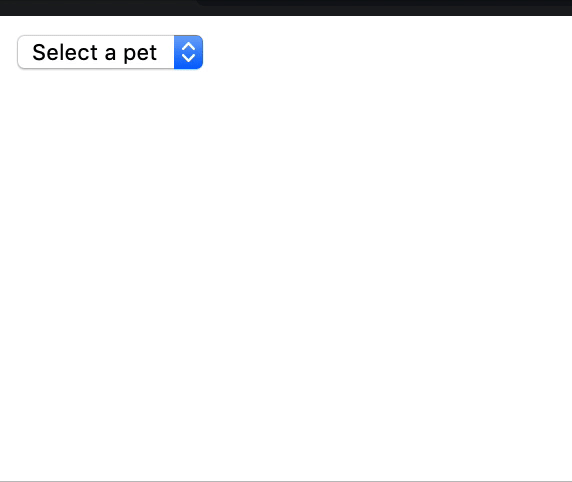

If your application is depended on a state that gets updated asynchronously, there is a good chance you have a bug. The bad news is that its hard or even almost impossible to reproduce in production. The good news is that you now know about it and we will learn how to reproduce it and fix it.

In this article I will use a demo application that I used in a previous article [React state update on an unmounted component](https://debuggr.io/react-update-unmounted-component). Although reading it is not a prerequisite, I do think its a good idea to read it.

_👀 I've uploaded a [starter repo to github](https://github.com/sag1v/react-race-conditions-debuggrio) so you won't have to copy paste the code.
You can clone and run it locally or use the **import** feature of [codesandbox.io](https://codesandbox.io/s/)_

This is how our application looks like: 


Basically we are selecting a pet and showing some info that we "fetch" from the server.

This is how the `Pets` component looks like:

``` jsx
function Pets() {
  const [pets, dispatch] = useReducer(petsReducer, initialState);

  const onChange = ({ target }) => {
    dispatch({ type: "PET_SELECTED", payload: target.value });
  };

  useEffect(() => {
    if (pets.selectedPet) {
      dispatch({ type: "FETCH_PET" });
      getPet(pets.selectedPet).then(data => {
        dispatch({ type: "FETCH_PET_SUCCESS", payload: data });
      });
    } else {
      dispatch({ type: "RESET" });
    }
  }, [pets.selectedPet]);

  return (
    <div>
      <select value={pets.selectedPet} onChange={onChange}>
        <option value="">Select a pet</option>
        <option value="cats">Cats</option>
        <option value="dogs">Dogs</option>
      </select>
      {pets.loading && <div>Loading...</div>}
      {pets.petData && <Pet {...pets.petData} />}
    </div>
  );
}
```

Our `Pets` component uses the `useReducer` hook to store some state.
Lets see the `petsReducer` and the initial state:

``` jsx
const initialState = { loading: false, selectedPet: "", petData: null }

function petsReducer(state, action) {
  switch (action.type) {
    case "PET_SELECTED": {
      return {
        ...state,
        selectedPet: action.payload
      };
    }
    case "FETCH_PET": {
      return {
        ...state,
        loading: true,
        petData: null
      };
    }
    case "FETCH_PET_SUCCESS": {
      return {
        ...state,
        loading: false,
        petData: action.payload
      };
    }

    case "RESET": {
      return initialState;
    }

    default:
      throw new Error( `Not supported action ${action.type}` );
  }
}
```

As you can see theres nothing special here, a simple reducer that manage our state.

The `Pets` component also use the `useEffect` hook for some side effects like fetching the data of our selected pet, we invoke the `getPet` function which returns a `Promise` and we dispatch the `FETCH_PET_SUCCESS` action with the returned data as the payload to update our state.

Note that `getPet` is not really hitting a server end-point, its just a function that simulate a server call. This is how it looks like:

``` jsx
const petsDB = {
  dogs: { name: "Dogs", voice: "Woof!", avatar: "🐶" },
  cats: { name: "Cats", voice: "Miauuu", avatar: "🐱" }
};

export function getPet(type) {
  return new Promise(resolve => {
    // simulate a fetch call
    setTimeout(() => {
      resolve(petsDB[type]);
    }, 1000);
  });
}
```

As you see, its nothing but a `setTimeout` inside a `Promise`.

## The bug

So far everything looks great, we chose a pet type from the Drop-down and we get the info `1000ms` later. Though when we are dealing with asynchronous operations we can't determine at what point of time exactly we are running our code, moreover we need to handle 2 or more operations simultaneously. What happens when the first operation is slower than the second operation? How are we dealing with the results?

Imagine this scenario:

1. The user select the `Cats` option.
2. We are fetching the `Cats` data from the server.
3. The user now select the `Dogs` option.
4. We are fetching the `Dogs` data from the server.
5. for some reason, the `Dogs` data received before the `Cats` data (yeah it happens!).
6. We display the `Dogs` data on the screen.
7. Couple of milliseconds later, the `Cats` data is received.
8. We display the `Cats` data on the screen, but the Drop-down still shows the `Dogs` as selected.

This is how it looks like on the screen:


How did we managed to do it? just a hard-coded longer delay for the `cats` type:

```jsx{2,7}
export function getPet(type) {
  const delay = type === "cats" ? 3500 : 500;
  return new Promise(resolve => {
    // immulate fetch call
    setTimeout(() => {
      resolve(petsDB[type]);
    }, delay);
  });
}
```

## The problem

Why is that happening? lets revisit our data fetching logic in `useEffect`:

```jsx{4-6}
  useEffect(() => {
    if (pets.selectedPet) {
      dispatch({ type: "FETCH_PET" });
      getPet(pets.selectedPet).then(data => {
        dispatch({ type: "FETCH_PET_SUCCESS", payload: data });
      });
    } else {
      dispatch({ type: "RESET" });
    }
  }, [pets.selectedPet]);
```
As you can see, our state update (using `dispatch`) is running inside the `.then()` function. It will run only when the `Promise` returned by `getPet` is resolved. When the user select a different option before the `Promise` is resolved, we trigger `getPet` again with its own `.then()` function. When the second (but faster) call is resolved, we run the function passed to `.then()` and updating the state with the passed in `data` object (`Dogs` data). When the first call is resolved, we run the function passed to it's `.then()` and updating the state with the passed in `data` object, a **WRONG** and none relevant data! Yes, the one with the cats 🙀🙀🙀

## The solution
One possible solution is to cancel the first request, we can use the [AbortController.abort()](https://developer.mozilla.org/en-US/docs/Web/API/AbortController/abort) (⚠️ experimental technology) or we can implement a [Cancelable promise](https://github.com/facebook/react/issues/5465#issuecomment-157888325).

If you can't or don't want to use these solutions, there is another solution. Basically our problem is that we store a key for the selected pet but we update the data object without checking that the data correspond to that key. If we will check that the key and the data correspond and only then we will trigger the update, we will not have this problem.  

Lets see how can we do that.

## Trial #1 (❌)

```jsx{2,6-8}
useEffect(() => {
  let _previousKey = pets.selectedPet;
  if (pets.selectedPet) {
    dispatch({ type: "FETCH_PET" });
    getPet(pets.selectedPet).then(data => {
      if (_previousKey === pets.selectedPet) {
        dispatch({ type: "FETCH_PET_SUCCESS", payload: data });
      }
    });
  } else {
    dispatch({ type: "RESET" });
  }
}, [pets.selectedPet]);
```

Here we are storing the `selectedPet` key in a different temp variable `_previousKey` and then inside the `.then()` function we check if the "current" `selectedPet` matches `_previousKey`.   

This won't work! We just override the `_previousKey` variable each time the `useEffect` is running, so we end up matching the same value over and over. This is also true if we were to declare the `_previousKey` variable outside the `useEffect` at the function component level scope, because it will run on each render.

## Trial #2 (❌)

```jsx{1,7,11-13}
let _previousKey;

function Pets() {
  //... 

  useEffect(() => {
    _previousKey = pets.selectedPet;
    if (pets.selectedPet) {
      dispatch({ type: "FETCH_PET" });
      getPet(pets.selectedPet).then(data => {
        if (_previousKey === pets.selectedPet) {
          dispatch({ type: "FETCH_PET_SUCCESS", payload: data });
        }
      });
    } else {
      dispatch({ type: "RESET" });
    }
  }, [pets.selectedPet]);

  return (...);
}
```
Here we are declaring the `_previousKey` outside the component's scope, this way we always get the latest value and not overriding it on each render or effect call.

Although it seems to be working fine and our problem is solved, we introduce a new bug. If we will have 2 different instances of `Pets` rendered, they will "share" this variable and will override it to each other.

## Trial #3 (✔️)

```jsx{3,6,10-12}
function Pets() {
  //...
  const _previousKeyRef = useRef(null);

  useEffect(() => {
    _previousKeyRef.current = pets.selectedPet;
    if (pets.selectedPet) {
      dispatch({ type: "FETCH_PET" });
      getPet(pets.selectedPet).then(data => {
        if (_previousKeyRef.current === pets.selectedPet) {
          dispatch({ type: "FETCH_PET_SUCCESS", payload: data });
        }
      });
    } else {
      dispatch({ type: "RESET" });
    }
  }, [pets.selectedPet]);

  return (...);
}
```

In trial #2 we made some progress but we ended up with kind of a "global" variable. What was missing is a variable attached to the instance of our component. In class components we would use the `this` key word to reference the instance -- `this._previousKey`. In function components the `this` key word doesn't reference the component's instance because there is no instance (you can read more about the `this` key word in [JavaScript - The "this" key word in depth](https://www.debuggr.io/js-this-in-depth/)). React solved the lack of instance issue with the `useRef` hook. Think of it as a mutable state object for your component that doesn't trigger a re-render when you update it (unlike `useState` or `useReducer`).

This way we can safely store the `_previousKey` and compare it to the current `selectedPet` and only if they match, update our state with the relevant data object. If you run the code now you will see that we fixed our bug 🙌

## Trial #3.5 (✔️)

```jsx{2,6-9,15}
useEffect(() => {
  let abort = false;

  if (pets.selectedPet) {
    dispatch({ type: "FETCH_PET" });
    getPet(pets.selectedPet).then(data => {
      if(!abort){
        dispatch({ type: "FETCH_PET_SUCCESS", payload: data });
      }
    });
  } else {
    dispatch({ type: "RESET" });
  }

  return () => abort = true;

}, [pets.selectedPet])
```

This is another possible solution. Instead of keeping track on the matching values, we can just use a simple flag that indicates if we should keep with our update state operation. Every time the effect runs we are initializing the `abort` variable with `false`, inside the cleanup function of the effect we set it to `true`. the effect will only run at first render and every time one of the values passed to the dependencies array is changed. The cleanup function will run just before each cycle of the effect and when the component is unmounted.  

This works great and probably the preferred solution for some people, but keep in mind that now your effect can't have other none related logic with none related dependencies in the array (and it shouldn't have!), because then the effect will re-run if those dependencies change and will trigger the cleanup function which will flip the `abort` flag.

Nothing is stopping you from having multiple `useEffect` functions, one for each logic operation.

### Custom useEffect

If we want to get real crazy with our hooks, we can create our own custom `useEffect` (or `useLayoutEffect`) which will provide us the "current status" of the effect:

```jsx
function useAbortableEffect(effect, dependencies) {
  const status = {}; // mutable status object
  useEffect(() => {
    status.aborted = false;
    // pass the mutable object to the effect callback
    // store the returned value for cleanup
    const cleanUpFn = effect(status);
    return () => {
      // mutate the object to signal the consumer
      // this effect is cleaning up
      status.aborted = true;
      if (typeof cleanUpFn === "function") {
        // run the cleanup function
        cleanUpFn();
      }
    };
  }, [...dependencies]);
}
```

And we will use it in our `Pet` component like this:

```jsx{1, 5}
  useAbortableEffect((status) => {
    if (pets.selectedPet) {
      dispatch({ type: "FETCH_PET" });
      getPet(pets.selectedPet).then(data => {
        if(!status.aborted){
          dispatch({ type: "FETCH_PET_SUCCESS", payload: data });
        }
      });
    } else {
      dispatch({ type: "RESET" });
    }
  }, [pets.selectedPet]);
```

Note how our custom effect callback now accepts a `status` argument which is an object that contains an `aborted` boolean property. If it is set to `true`, that means our effect got cleaned and re-run (which means our dependencies are changed or the component was un-mounted).

I kind of like this pattern and i wish react `useEffect` would get us this behavior out of the box. I even created an [RFC on the react repo](https://github.com/reactjs/rfcs/issues/137) for this if you want to comment or improve it.

## Good news

Note that this is not a react specific problem, this is a challenge that most if not all of the UI libraries or framework are facing, due to the nature of asynchronous operations and state management. The good news is that the react team is working on a great feature called [Concurrent Mode](https://reactjs.org/docs/concurrent-mode-intro.html) and one of its features is [Suspense](suspense) which should cover this issue out of the box.

## Wrapping up

We saw that a simple component with a state and asynchronous operation can produce a nasty bug, we might not even know it's there until we face it in production. My conclusion is that whenever we update a state (can be local or in a state manager) inside an asynchronous callback, we must check if the arguments that we passed to the asynchronous function is corresponding to the data we received in the callback.

Hope you found this article helpful, if you have a different approach or any suggestions I would love to hear about them, you can tweet or DM me [@sag1v](https://mobile.twitter.com/sag1v). 🤓