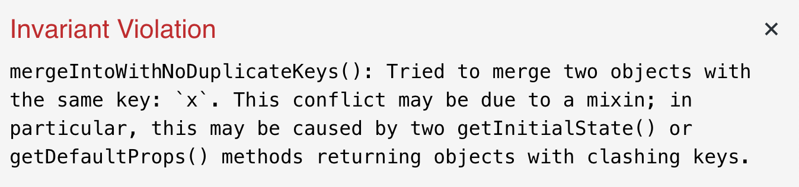
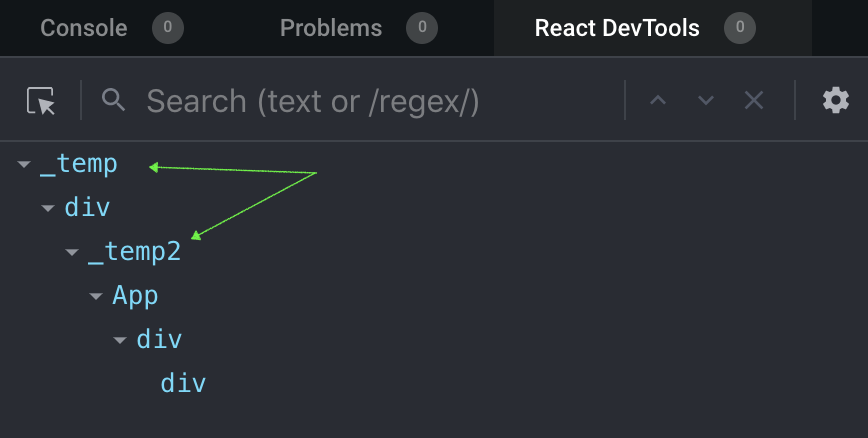
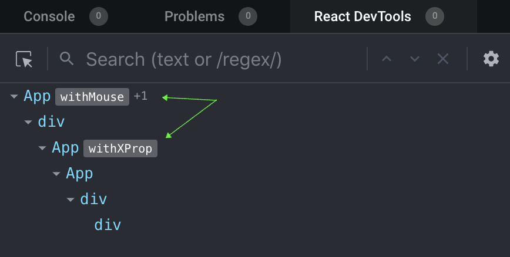

In this article we will learn about the options and patterns for sharing behavior and logic across components, we will travel in time and explore the evolution of logic sharing in react.

## The challenge

Our challenge is to share logic across components, in this case we have a component that tracks the movement of the `mouse` and we want to share the logic of the mouse movement tracking.

This is how our application looks like:


We are going back in time to the first version of react (this will work if you use react version 15.6.2 and below) and we are using the good old `React.createClass` API.

This is how our component looks like now:  

```jsx
const App = React.createClass({
  getInitialState() {
    return { x: "", y: "" };
  },

  onMouseMove(e) {
    this.setState({
      x: e.clientX,
      y: e.clientY
    });
  },

  render() {
    const { x, y } = this.state;
    return (
      <div className="app" onMouseMove={this.onMouseMove}>
        <div>{`${x} - ${y}`}</div>
      </div>
    );
  }
});
```

What we want to do is to extract the logic related to the tracking of the mouse and be able to use it on any component we want in the future.

So basically we want to extract the `state` and the `onMouseMove` handler.

## Mixins - The children of the forest

Since the beginning of time (or at least since [october 2013](https://github.com/facebook/react/blob/master/CHANGELOG.md#050-october-16-2013)), `mixins` were a way to share logic across components. It was fairly easy to use:

<sub><sup>You can use the [create-react-class](https://www.npmjs.com/package/create-react-class) library instead of using an old version of `react`.</sub></sup>

```jsx{1-12,15}
const mouseMoveMixin = {
  getInitialState() {
    return { x: "", y: "" };
  },

  onMouseMove(e) {
    this.setState({
      x: e.clientX,
      y: e.clientY
    });
  }
};

const App = React.createClass({
  mixins: [mouseMoveMixin],

  render() {
    const { x, y } = this.state;
    return (
      <div className="app" onMouseMove={this.onMouseMove}>
        <div>{`${x} - ${y}`}</div>
      </div>
    );
  }
});
```

As you can see, a mixin is just an object that can be placed inside the `mixins` array property.

Mixins were great and solved the initial challenge of sharing logic across components, though they did have some issues.

#### Why mixins are dead?

**ES2015 `class`** - For starters, `React.createClass` is dead. When the ES2015 `class` feature was released to the wild, I guess the react team realized that native classes are better than maintaining a react implementation of classes. So without `React.createClass` we no longer have support for `mixins`.

**indirection** - The second reason `mixins` were abandoned, is the indirection of state and variables. If we look at the code again, imagine that the `mouseMoveMixin` mixin was in a different file or maybe we might have another mixin in our `mixins` array, we might get confused as where the `x` and `y` in our state comes from:

```jsx{5}
const App = React.createClass({
  mixins: [mouseMoveMixin, geoMixin],

  render() {
    const { x, y } = this.state; // where is that coming from?
    return (
      <div className="app" onMouseMove={this.onMouseMove}>
        <div>{`${x} - ${y}`}</div>
      </div>
    );
  }
});
```

**key conflicts** - Another pitfall with `mixins` is the key conflict. Imagine that we have 2 mixins and both output the same key for our state:

```jsx{3,16}
const mouseMoveMixin = {
  getInitialState() {
    return { x: "", y: "" };
  },

  onMouseMove(e) {
    this.setState({
      x: e.clientX,
      y: e.clientY
    });
  }
};

const geoMixin = {
  getInitialState() {
    return { x: 0.22, y: 1.3333333 };
  }
}

const App = React.createClass({
  mixins: [mouseMoveMixin, geoMixin],

  render() {
    const { x, y } = this.state;
    return (
      <div className="app" onMouseMove={this.onMouseMove}>
        <div>{`${x} - ${y}`}</div>
      </div>
    );
  }
});
```

Luckily react will throw an error and warn us about it:



## HOC - The knight in shining armor

With the appearance of ES2015 classes and the deprecation of `mixins`, a new pattern emerged, Higher-Order Components.

From react's [documentations](https://reactjs.org/docs/higher-order-components.html):

> A higher-order component (HOC) is an advanced technique in React for reusing component logic. HOCs are not part of the React API, per se. They are a pattern that emerges from React’s compositional nature.

> Concretely, a higher-order component is a function that takes a component and returns a new component.

So for our use case, a HOC might look something like this:

```jsx
const withMouse = Component => {
  return class extends React.Component {
    state = { x: "", y: "" };

    onMouseMove = e => {
      this.setState({
        x: e.clientX,
        y: e.clientY
      });
    };

    render() {
      return (
        <div onMouseMove={this.onMouseMove}>
          <Component {...this.props} {...this.state} />
        </div>
      );
    }
  };
};
```

And this is how we would use it:

```jsx{3-4,13}
class App extends React.Component {
  render() {
    // we now get the x and y via props
    const { x, y } = this.props;
    return (
      <div className="app">
        <div>{`${x} - ${y}`}</div>
      </div>
    );
  }
};

App = withMouse(App)
```

Note that now we are getting the `x` and `y` variables from `props` and not storing them in a `state`. Actually our HOC manage that `state` for us, this is the very logic we wanted to share.

So it seems that we achieved our initial goal here, we are using ES2015 classes **AND** sharing our logic. Though lets see if we solved the issues we had with `mixins`:

**ES2015 `class`** - Yeah, as mentioned above we now support ES2015 classes.

**Indirection** - Seems like we still have an indirection issue here, we still ask ourself _"where is this prop comes from?"_

**Key conflicts** - This issue still exists, if we wrap our component with multiple HOC's, one might override the other.

```jsx{22-29, 42}
const withMouse = Component => {
  return class extends React.Component {
    state = { x: "", y: "" };

    onMouseMove = e => {
      this.setState({
        x: e.clientX,
        y: e.clientY
      });
    };

    render() {
      return (
        <div onMouseMove={this.onMouseMove}>
          <Component {...this.props} {...this.state} />
        </div>
      );
    }
  };
};

const withXProp = Component => {
  return class extends React.Component {
    state = { x: `I'm X!` };
    render() {
      return <Component {...this.props} {...this.state} />;
    }
  };
};

class App extends React.Component {
  render() {
    const { x, y } = this.props;
    return (
      <div className="app">
        <div>{`${x} - ${y}`}</div>
      </div>
    );
  }
}

App = withMouse(withXProp(App));
```


In fact, we went a step back. With `mixins` we at least had a warning that we have a conflict with keys, with HOC's we don't get that warning and as you can see, our application has a bug.

**Static composition** - With HOCs we compose at "build time" or "declaration time", this means we can't do dynamic composition. In order to do dynamic composition we must put that logic inside the render method, but using a HOC inside `render` [will introduce an unexpected behavior such as state loss](https://reactjs.org/docs/higher-order-components.html#dont-use-hocs-inside-the-render-method).

### HOC's boiler plate

You might not notice but our HOC is missing some important things.

**Component Identity** - When we wrap a component with a HOC we introduce another level of nodes in our tree, but our new node doesn't have a name. Lets see how the node tree looks like in react dev-tools:



In order to fix this and give a meaningful name for the wrapping component we need to change the `displayName` property of the component our HOC creates:

```jsx{21,34}
const withMouse = Component => {
  class Inner extends React.Component {
    state = { x: "", y: "" };

    onMouseMove = e => {
      this.setState({
        x: e.clientX,
        y: e.clientY
      });
    };

    render() {
      return (
        <div onMouseMove={this.onMouseMove}>
          <Component {...this.props} {...this.state} />
        </div>
      );
    }
  }

  Inner.displayName = `withMouse(${Component.displayName || Component.name})`;

  return Inner;
};

const withXProp = Component => {
  class Inner extends React.Component {
    state = { xy: `I'm X!` };
    render() {
      return <Component {...this.props} {...this.state} />;
    }
  };

  Inner.displayName = `withXProp(${Component.displayName || Component.name})`;

  return Inner;
};
```

We no longer return immediately the component, we first declare it - `Inner` in this case, then we manipulate it's `displayName` property and return the component.

This is how it looks like now in react dev-tools:



**Static properties** - When we wrap our component with a HOC we kind of "hijacking" the static properties, for example:

```jsx{1,3}
App.someStaticProperty = "I'm a static property";
App = withMouse(App);
console.log(App.someStaticProperty); // undefined
```

In order to fix this we need to somehow hoist our static properties up to the wrapping component, this is not an easy task as we need to know the names of the properties. Luckily there is a library that's already doing it for us - [hoist-non-react-statics](https://github.com/mridgway/hoist-non-react-statics)

```jsx{1,25,38,30,32}
import hoistNonReactStatics from 'hoist-non-react-statics';

const withMouse = Component => {
  class Inner extends React.Component {
    state = { x: "", y: "" };

    onMouseMove = e => {
      this.setState({
        x: e.clientX,
        y: e.clientY
      });
    };

    render() {
      return (
        <div onMouseMove={this.onMouseMove}>
          <Component {...this.props} {...this.state} />
        </div>
      );
    }
  }

  Inner.displayName = `withMouse(${Component.displayName || Component.name})`;

  return hoistNonReactStatics(Inner, Component);
};

class App extends React.Component {...}

App.someStaticProperty = "I'm a static property";
App = withMouse(App);
console.log(App.someStaticProperty); // I'm a static property 
```

**Loosing ref** - What happens if someone wants to reference our wrapped component? the `App` component in our case.

```jsx{2,4,5}
App = withMouse(App);
let ourRef;
const rootElement = document.getElementById("root");
ReactDOM.render(<App ref={node => ourRef = node} />, rootElement);
console.log(ourRef) // Inner??
```

Because `ref` is a special prop that handled by react and doesn't get passed like other props (same as `key`) we need to handle it somehow. We have couple of options here:

**Using an explicit prop for the ref:**

```jsx{13,16,32}
const withMouse = Component => {
    class Inner extends React.Component {
        state = { x: "", y: "" };

        onMouseMove = e => {
            this.setState({
                x: e.clientX,
                y: e.clientY
            });
        };

        render() {
            const { componentRef, ...restOfProps } = this.props;
            return (
                <div onMouseMove={this.onMouseMove}>
                    <Component {...restOfProps} ref={componentRef} {...this.state} />
                </div>
            );
        }
    }

    Inner.displayName = `withMouse(${Component.displayName || Component.name})`;
    return hoistNonReactStatics(Inner, Component);
};

class App extends React.Component {...}

App = withMouse(App);

let ourRef;
const rootElement = document.getElementById("root");
ReactDOM.render(<App componentRef={node => (ourRef = node)} />, rootElement);
console.log(ourRef); // App
```

Note how we need to introduce another prop to our API: `componentRef`. 🤮

**Using the [forwardRef API](https://reactjs.org/docs/forwarding-refs.html#forwarding-refs-in-higher-order-components)** which is available since [React v16.3.0](https://reactjs.org/blog/2018/03/29/react-v-16-3.html#forwardref-api)

```jsx{13,16,24-26,37}
const withMouse = Component => {
    class Inner extends React.Component {
        state = { x: "", y: "" };

        onMouseMove = e => {
            this.setState({
                x: e.clientX,
                y: e.clientY
            });
        };

        render() {
            const { componentRef, ...restOfProps } = this.props;
            return (
                <div onMouseMove={this.onMouseMove}>
                    <Component {...restOfProps} ref={componentRef} {...this.state} />
                </div>
            );
        }
    }

    Inner.displayName = `withMouse(${Component.displayName || Component.name})`;

    const withRef = forwardRef((props, ref) => {
        return <Inner {...props} componentRef={ref} />
    });

    return hoistNonReactStatics(withRef, Component);
};

class App extends React.Component {...}

App = withMouse(App);

let ourRef;
const rootElement = document.getElementById("root");
ReactDOM.render(<App ref={node => (ourRef = node)} />, rootElement);
console.log(ourRef); // App
```

With `forwardRef` we can abstract this behavior and we don't need to introduce another prop to our API, thus the consumers of the component would be able to pass the regular `ref` prop.

This is the minimum effort we need to put for our HOC **and we will need to do that for each and every one of them!** 😫

## Render props - A Law-Worthy Knight

A quote from [react documentations](https://reactjs.org/docs/render-props.html#use-render-props-for-cross-cutting-concerns)

>The term “render prop” refers to a technique for sharing code between React components using a prop whose value is a function.

>A component with a render prop takes a function that returns a React element and calls it instead of implementing its own render logic.

You don't have to call your prop `render`, in fact this is also common to use the `children` prop as a function.
So for our use case the "render prop" or "children as a function" pattern might look like this:

```jsx{15,25-29}
class Mouse extends React.Component {
  state = { x: "", y: "" };

  onMouseMove = e => {
    this.setState({
      x: e.clientX,
      y: e.clientY
    });
  };

  render() {
    const { children } = this.props;
    return (
      <div onMouseMove={this.onMouseMove}>
        {children(this.state)}
      </div>
    );
  }
}

class App extends React.Component {
  render() {
    return (
      <div className="app">
        <Mouse>
          {mouseState => (
             <div>{`${mouseState.x} - ${mouseState.y}`}</div>
          )}
        </Mouse>
      </div>
    );
  }
}
```

Lets review the issues we had with `mixins` and HOCs and see if we still have them:

**ES2015 classes** - Yeah, we can use classes.

**Indirection** - We no longer have an indirection, we know exactly where the values are coming from.

**Key conflicts** - We can name our variables whatever we want, so we have no conflicts:

```jsx{2,18,28-39}
class Mouse extends React.Component {
  state = { x: "", y: "" };

  onMouseMove = e => {
    this.setState({
      x: e.clientX,
      y: e.clientY
    });
  };

  render() {
    const { children } = this.props;
    return <div onMouseMove={this.onMouseMove}>{children(this.state)}</div>;
  }
}

class Xprop extends React.Component {
  state = { x: "I'm X!" };
  render() {
    return this.props.children(this.state);
  }
}

class App extends React.Component {
  render() {
    return (
      <div className="app">
        <Mouse>
          {mouseState => (
            <Xprop>
              {xPropstate => (
                <div>
                  <div>{`${mouseState.x} - ${mouseState.y}`}</div>
                  <div>{xPropstate.x}</div>
                </div>
              )}
            </Xprop>
          )}
        </Mouse>
      </div>
    );
  }
}
```

**Boiler plate** - With this pattern we are giving back the responsibility of what to render to the consumers. With HOCs, we were responsible for what to render thus we had a lot of things to take care of, like component's name, static properties and refs. Now we don't need to care about any of those things as the consumer of our component is doing the render part.

**Dynamic composition** -  Because the consumers are doing the render part, it allows them to dynamically compose what to render. Like render `ComponentA` or `ComponentB` based on the value of `x`, something they didn't able to achieve with our HOC.

**Pitfalls** - Render props did solve most if not all of our issues but they do come with some caveats. Quoting react's documentations:

>Using a render prop can negate the advantage that comes from using `React.PureComponent` if you create the function inside a render method. This is because the shallow prop comparison will always return false for new props, and each render in this case will generate a new value for the render prop.

In this case we can get around this issue by creating an instance method (outside the `render` method):

```jsx{18-20,25}
class Mouse extends React.PureComponent {
  state = { x: "", y: "" };

  onMouseMove = e => {
    this.setState({
      x: e.clientX,
      y: e.clientY
    });
  };

  render() {
    const { children } = this.props;
    return <div onMouseMove={this.onMouseMove}>{children(this.state)}</div>;
  }
}

class App extends React.Component {
  renderMouse = mouseState => (
    <div>{`${mouseState.x} - ${mouseState.y}`}</div>
  )
  render() {
    return (
      <div className="app">
        <Mouse>
          {this.renderMouse}
        </Mouse>
      </div>
    );
  }
}
```

**Render props callback hell** - If we compose multiple render props we might get an ugly nested callbacks tree in our render.

## Hooks - The new Primitives

A quote from [react's documentations](https://reactjs.org/docs/hooks-state.html#hooks-and-function-components):

>Hooks are a new addition in React 16.8. They let you use state and other React features without writing a class

For me, hooks are like `mixins` on steroids. They are not a pattern like HOCs or render props but a new primitive exposed to us by react. If so far components were the smallest building blocks, now we get an even smaller part, hooks.

Lets see how our code might look like with hooks:

```jsx{3-12,15,18-20}
import React, { useState } from "react";

function useMouse() {
  const [position, setPosition] = useState({ x: 0, y: 0 });
  const onMouseMove = e => {
    setPosition({
      x: e.clientX,
      y: e.clientY
    });
  };
  return [position, onMouseMove];
}

function App() {
  const [mousePosition, onMouseMove] = useMouse();
  return (
    <div className="app">
      <div onMouseMove={onMouseMove}>
        {`${mousePosition.x} - ${mousePosition.y}`}
      </div>
    </div>
  );
}

```

As you can see, with less code we managed to achieve better results. Lets review our issues from other solutions again:

**sharing logic** - Check

**ES2015 classes** - No need for classes anymore, we are using plain functions.

**Indirection** - We know exactly where our data is coming from, so no indirection.

**Key conflicts** - We have no conflicts because we can name our variables whatever we want.

**Boiler plate** - We have no boiler plate to worry about (unlike HOCs)

**Dynamic composition** - We can dynamically compose our tree based on the values we received from our custom hook.

**Smaller node tree** - We didn't mention it earlier but we managed to reduce the size of our tree, meaning we have less levels of nodes than we had with HOCs and render props.

**Sharing none-UI logic** - Because hooks are not components, they can return anything and not only valid `JSX`. This allow us to share logic that is not UI specific, like `useFetch` or `useLocalStorage` etc.

Seems like hooks managed to solve our initial challenge of sharing logic across components without the issues that raised by the other solutions, in fact they also provide some extra goodies like smaller code foot-print and decoupling logic from UI.

## Wrapping up

We made a long journey, from the built-in mixins to patterns like HOCs and render-props and finally to the great addition of react, hooks. In my opinion, we kind of made a full circle. I think that `mixins` were the ultimate solution but as mentioned above they had some issues. With time and some milage, we got `hooks` which for me are sort of a re-write of `mixins` with all the experience and knowledge gained by the react team. Sometimes we need to make a full circle to really understand the challenges we are facing and find the best solutions for them.

Hope you found this article helpful, if you have something to add or any suggestions or feedbacks I would love to hear about them, you can tweet or DM me [@sag1v](https://mobile.twitter.com/sag1v). 🤓
