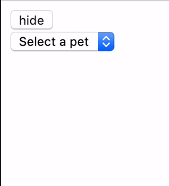
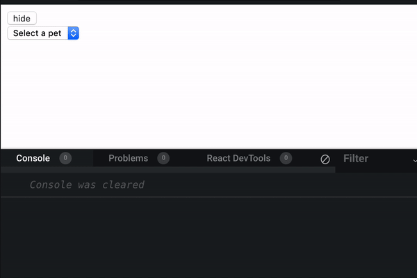
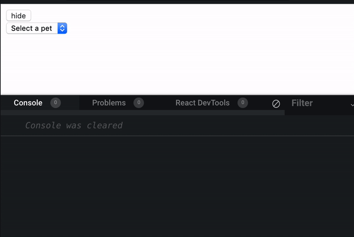

If you are a react developer, there is a good chance that you faced this warning at least once:

> Warning: Can't perform a React state update on an unmounted component. This is a no-op, but it indicates a memory leak in your application. To fix, cancel all subscriptions and asynchronous tasks in a useEffect cleanup function.

In order to understand how to fix this warning, we need to understand why it is happening. We will need to reproduce it in a consistent way.


*⚠️ Note that in this article i use react hooks, if you are using react class components you may see in the warning a reference to componentWillUnmount instead of the useEffect cleanup function.*


## Reproduce the warning

_👀 I've uploaded a [starter repo to github](https://github.com/sag1v/react-async-state-debuggrio) so you won't have to copy paste the code.
You can clone and run it locally or use the **import** feature of [codesandbox.io](https://codesandbox.io/s/)_


If we look at the warning again, we can see that there are 2 main parts playing a role here:

1. A React state update
2. An unmounted component

In order to create these, we will build this simple drop-down with asynchronous data fetching


## State updates

``` jsx
function Pets() {
  const [pets, dispatch] = useReducer(petsReducer, initialState);

  const onChange = ({ target }) => {
    dispatch({ type: "PET_SELECTED", payload: target.value });
  };

  useEffect(() => {
    if (pets.selectedPet) {
      dispatch({ type: "FETCH_PET" });
      getPet(pets.selectedPet).then(data => {
        dispatch({ type: "FETCH_PET_SUCCESS", payload: data });
      });
    } else {
      dispatch({ type: "RESET" });
    }
  }, [pets.selectedPet]);

  return (
    <div>
      <select value={pets.selectedPet} onChange={onChange}>
        <option value="">Select a pet</option>
        <option value="cats">Cats</option>
        <option value="dogs">Dogs</option>
      </select>
      {pets.loading && <div>Loading...</div>}
      {pets.petData && <Pet {...pets.petData} />}
    </div>
  );
}
```

Here we have the `Pets` component, it uses the `useReducer` hook to store some state.
Lets see the `petsReducer` and the initial state:

``` jsx
const initialState = { loading: false, selectedPet: "", petData: null }

function petsReducer(state, action) {
  switch (action.type) {
    case "PET_SELECTED": {
      return {
        ...state,
        selectedPet: action.payload
      };
    }
    case "FETCH_PET": {
      return {
        ...state,
        loading: true,
        petData: null
      };
    }
    case "FETCH_PET_SUCCESS": {
      return {
        ...state,
        loading: false,
        petData: action.payload
      };
    }

    case "RESET": {
      return initialState;
    }

    default:
      throw new Error( `Not supported action ${action.type}` );
  }
}
```

As you can see theres nothing special here, a simple reducer that manage our state.

The `Pets` component also use the `useEffect` hook for some side effects like fetching the data of our selected pet, we invoke the `getPet` function which returns a `Promise` and we dispatch the `FETCH_PET_SUCCESS` action with the returned data as the payload to update our state.

Note that `getPet` is not really hitting a server end-point, its just a function that simulate a server call. This is how it looks like:

``` jsx
const petsDB = {
  dogs: { name: "Dogs", voice: "Woof!", avatar: "🐶" },
  cats: { name: "Cats", voice: "Miauuu", avatar: "🐱" }
};

export function getPet(type) {
  return new Promise(resolve => {
    // simulate a fetch call
    setTimeout(() => {
      resolve(petsDB[type]);
    }, 1000);
  });
}
```

As you see, its nothing but a `setTimeout` inside a `Promise` .

Our `App` is basically just rendering this `Pets` component:

``` jsx
function App() {
  return (
    <div>
      <Pets />
    </div>
  );
}
```

Ok first part of our problem is accomplished, thats the `React state update` , now we need to create the 2nd part - `An unmounted component` .

## Un-mounting a component

This is relatively easy to accomplish using a state and a conditional rendering, we will store a boolean flag at the `App` level and we will render the `<Pets />` component accordingly while using a toggle button.

``` jsx{2-6, 10-11}
function App() {
  const [showPets, setShowPets] = useState(true);

  const toggle = () => {
    setShowPets(state => !state);
  };

  return (
    <div>
      <button onClick={toggle}>{showPets ? "hide" : "show"}</button>
      {showPets && <Pets />}
    </div>
  );
}
```

This is how our application should look like


## Reproduction
Ok, now that we have both conditions for the warning to appear lets try it. If we look again at the warning:

> Warning: Can't perform a React state update on an unmounted component. This is a no-op, but it indicates a memory leak in your application. To fix, cancel all subscriptions and asynchronous tasks in a useEffect cleanup function.

Lets focus on this line here:
 > React state update on an unmounted component

If we select a pet, we know that it will take our `getPet` at least 1 second to return our data. After our data is returned we are updating the state, if we will un-mount the `Pet` component before that 1 second (before our data is received) we will trigger an update on an unmounted component.

So this is how you do it:
*If you can't make it with a 1 second delay, try to increase the `timeOut` in the `getPet` function.



OK this is part one of our task, now we need to fix it.

## The fix
You may be surprised but the fix for this issue is actually the easy part. React is providing a clear and a very helpful message, with a guidance to the solution:

> To fix, cancel all subscriptions and asynchronous tasks in a useEffect cleanup function.

Well, we may not exactly subscribing to anything here, but we do have an `asynchronous tasks`, remember the `getPet` asynchronous function:

``` jsx{11-13}
function Pets() {
  const [pets, dispatch] = useReducer(petsReducer, initialState);

  const onChange = ({ target }) => {
    dispatch({ type: "PET_SELECTED", payload: target.value });
  };

  useEffect(() => {
    if (pets.selectedPet) {
      dispatch({ type: "FETCH_PET" });
      getPet(pets.selectedPet).then(data => {
        dispatch({ type: "FETCH_PET_SUCCESS", payload: data });
      });
    } else {
      dispatch({ type: "RESET" });
    }
  }, [pets.selectedPet]);

  return (
    <div>
      <select value={pets.selectedPet} onChange={onChange}>
        <option value="">Select a pet</option>
        <option value="cats">Cats</option>
        <option value="dogs">Dogs</option>
      </select>
      {pets.loading && <div>Loading...</div>}
      {pets.petData && <Pet {...pets.petData} />}
    </div>
  );
}
```

So basically we just need to **NOT** update the state in the callback if the component is not mounted already. 

```jsx{9,13-15,21}
function Pets() {
  const [pets, dispatch] = useReducer(petsReducer, initialState);

  const onChange = ({ target }) => {
    dispatch({ type: "PET_SELECTED", payload: target.value });
  };

  useEffect(() => {
    let mounted = true;
    if (pets.selectedPet) {
      dispatch({ type: "FETCH_PET" });
      getPet(pets.selectedPet).then(data => {
        if(mounted){
          dispatch({ type: "FETCH_PET_SUCCESS", payload: data });
        }
      });
    } else {
      dispatch({ type: "RESET" });
    }

    return () => mounted = false;

  }, [pets.selectedPet]);

  return (
    <div>
      <select value={pets.selectedPet} onChange={onChange}>
        <option value="">Select a pet</option>
        <option value="cats">Cats</option>
        <option value="dogs">Dogs</option>
      </select>
      {pets.loading && <div>Loading...</div>}
      {pets.petData && <Pet {...pets.petData} />}
    </div>
  );
}
```

Every time our effect will run, we are setting a local variable `mounted` to `true`, we set it to false on the cleanup function of the effect (like suggested by react). And most importantly, we are updating the state if and only if that value is `true`, that is if the component is un-mounted meaning our variable is set to false, it wont enter the `if` block.

So this is it, we are no longer receiving the warning:


## Bonus Tip

We set a local variable inside the `useEffect` scope, if we want to re-use this variable inside another `useEffect` we can use `useRef`, which is sort of a none rendering state for components. 

For example:

```jsx{3,10,14-16,22,27}
function Pets() {
  const [pets, dispatch] = useReducer(petsReducer, initialState);
  const isMountedRef = useRef(null);

  const onChange = ({ target }) => {
    dispatch({ type: "PET_SELECTED", payload: target.value });
  };

  useEffect(() => {
    isMountedRef.current = true;
    if (pets.selectedPet) {
      dispatch({ type: "FETCH_PET" });
      getPet(pets.selectedPet).then(data => {
        if(isMountedRef.current){
          dispatch({ type: "FETCH_PET_SUCCESS", payload: data });
        }
      });
    } else {
      dispatch({ type: "RESET" });
    }

    return () => isMountedRef.current = false;

  }, [pets.selectedPet]);

  useEffect(() => {
      // we can access isMountedRef.current here as well
  })

  return (
    <div>
      <select value={pets.selectedPet} onChange={onChange}>
        <option value="">Select a pet</option>
        <option value="cats">Cats</option>
        <option value="dogs">Dogs</option>
      </select>
      {pets.loading && <div>Loading...</div>}
      {pets.petData && <Pet {...pets.petData} />}
    </div>
  );
}
```

The great thing about hooks is that we can extract this tiny logic to a custom hook and reuse it across components. One possible implementation can be something like this: 

```jsx{1-10,14,24}
function useIsMountedRef(){
  const isMountedRef = useRef(null);

  useEffect(() => {
    isMountedRef.current = true;
    return () => isMountedRef.current = false;
  });

  return isMountedRef;
}

function Pets() {
  const [pets, dispatch] = useReducer(petsReducer, initialState);
  const isMountedRef = useIsMountedRef();

  const onChange = ({ target }) => {
    dispatch({ type: "PET_SELECTED", payload: target.value });
  };

  useEffect(() => {
    if (pets.selectedPet) {
      dispatch({ type: "FETCH_PET" });
      getPet(pets.selectedPet).then(data => {
        if(isMountedRef.current){
          dispatch({ type: "FETCH_PET_SUCCESS", payload: data });
        }
      });
    } else {
      dispatch({ type: "RESET" });
    }
  }, [pets.selectedPet, isMountedRef]);

  return (
    <div>
      <select value={pets.selectedPet} onChange={onChange}>
        <option value="">Select a pet</option>
        <option value="cats">Cats</option>
        <option value="dogs">Dogs</option>
      </select>
      {pets.loading && <div>Loading...</div>}
      {pets.petData && <Pet {...pets.petData} />}
    </div>
  );
}
```

## Wrapping up
We saw how a simple component with an asynchronous state update may yield this common warning, think about all those components you have with a similar case. Make sure you check if the component is actually mounted before you perform a state update.

Hope you found this article helpful, if you have a different approach or any suggestions i would love to hear about them, you can tweet or DM me [@sag1v](https://mobile.twitter.com/sag1v). 🤓